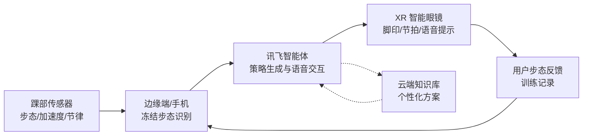
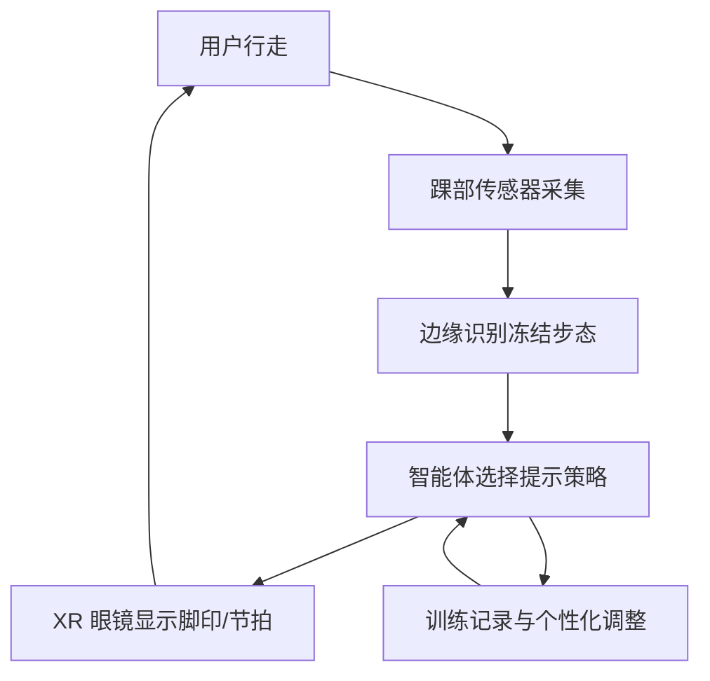

# NeuroStep 视觉规划文档

项目：NeuroStep，面向帕金森冻结步态的 XR 智能助行眼镜  
输出身份：视觉 / 绘图 agent  
使用建议：所有生成图尽量不包含可读文字；PPT 中的标题、标签、数据、按钮文案由主 agent 用可编辑文本重排。

## 总体视觉方向

- 画面关键词：温暖医疗科技、真实生活场景、轻量 XR、可穿戴联动、节律提示、非侵入式辅助。
- 主色建议：医疗蓝 `#2563EB`、青绿色 `#14B8A6`、提示琥珀 `#F59E0B`、中性深灰 `#1F2937`、浅背景 `#F8FAFC`。
- 图像风格：建议采用半写实 3D / 高级医疗科技插画，不做夸张赛博朋克；老人和照护场景要尊重、平静、有安全感。
- 统一约束：不要在生成图中放 UI 文字、英文按钮、品牌 logo、假数据、医疗诊断结论；不要出现摔倒、恐惧表情、血腥、医院抢救感。
- 版式建议：16:9，关键图留出上方或左侧 20%-30% 空白，方便主 agent 放可编辑标题。

## 可生成关键图资产

### 资产 1：冻结步态场景与 XR 脚印节律提示

建议文件名：`generated_scene_xr_footprints.png`

中文提示词：

```text
为课程 PPT 生成一张 16:9 横版医疗科技概念图。场景是一位帕金森老人正在家中客厅或康复中心走廊出现冻结步态，身体停在门槛附近，姿态谨慎但不痛苦；他佩戴轻量智能眼镜，视野前方的地面出现半透明 XR 脚印和节律线提示，脚印沿着前进方向有规律排列，像温和的蓝绿色光标，帮助重新启动步伐。旁边可有一位家属或康复师在远处观察但不抢画面。画面真实、温暖、干净，医疗科技感，浅色背景，蓝绿与琥珀点缀。不要任何可读文字、logo、按钮、屏幕文字、夸张科幻头盔、拐杖品牌、跌倒或恐惧表情。
```

English prompt:

```text
Create a 16:9 landscape medical technology concept image for a course presentation. Show an older adult with Parkinson's experiencing freezing of gait near a doorway in a home living room or rehabilitation corridor. The person wears lightweight smart glasses. In front of their feet, semi-transparent XR footprints and rhythmic guide lines appear on the floor, arranged in a calm regular pattern in teal-blue light with subtle amber accents, helping restart walking. A family member or therapist may observe in the background without dominating the scene. Warm, respectful, realistic, clean, premium healthcare technology style, bright neutral environment. No readable text, no logos, no buttons, no screen text, no bulky sci-fi helmet, no branded cane, no falling, no fearful expression.
```

构图：人物放右侧或中间偏右，XR 脚印从近景延伸到前方，形成引导线；左侧留标题空间。  
避免错误：不要把 XR 做成密集 HUD 文字；不要让老人看起来正在摔倒；不要出现医生抢救或医院病床。  
适用页面：第 2 页背景、第 3 页问题、第 4 页技术方案。

### 资产 2：技术架构数据流无字底图

建议文件名：`generated_architecture_flow.png`

中文提示词：

```text
生成一张 16:9 横版无文字技术架构背景图，用抽象但清晰的方式表达智能助行眼镜的数据流。画面从左到右依次表现：踝部可穿戴传感器采集步态信号、智能眼镜接收与显示 XR 脚印、手机或边缘设备运行智能体分析、云端/知识库提供个性化策略，最后回到地面节律提示。使用发光节点、细线箭头、数据粒子和简洁设备图标风格，但不要任何文字、数字、logo 或 UI 字。整体干净、适合 PPT 叠加可编辑标签，医疗蓝、青绿、琥珀点缀，浅色或深浅渐变背景均可。
```

English prompt:

```text
Generate a 16:9 landscape text-free technology architecture background for an intelligent walking-assist smart-glasses system. Express a left-to-right data flow: ankle wearable sensors capture gait signals, smart glasses receive and display XR footprints, a phone or edge device runs an AI agent analysis, a cloud or knowledge base provides personalized strategies, and feedback returns to rhythmic floor cues. Use glowing nodes, fine arrows, subtle data particles, and clean device-icon silhouettes, but no readable text, no numbers, no logos, and no UI words. Clean presentation-ready composition with room for editable labels, healthcare blue, teal, and amber accents.
```

构图：五个节点横向排布；节点之间用可见但不过亮的箭头线；中心智能体节点稍大。  
避免错误：不要生成错误拼写的英文标签；不要做成真实电路板；不要让箭头方向混乱。  
适用页面：第 5 页技术架构。

### 资产 3：眼镜 / 踝部传感器 / 智能体联动产品图

建议文件名：`generated_device_ecosystem.png`

中文提示词：

```text
生成一张 16:9 横版产品生态概念图，展示 NeuroStep 的三个核心硬件/软件元素：轻量 XR 智能眼镜、佩戴在脚踝的柔性传感器环、手机中的智能体应用。三者以柔和的发光连线连接，旁边可以有半透明脚印节律提示作为反馈结果。风格为高级产品渲染 + 医疗可穿戴设计，白色桌面或浅色背景，材质真实，设备简洁可信，蓝绿色科技光效，琥珀色提示点缀。不要任何可读文字、app 文案、logo、品牌标识、夸张头盔、复杂机械外骨骼。
```

English prompt:

```text
Create a 16:9 landscape product ecosystem concept render for NeuroStep. Show three core elements: lightweight XR smart glasses, a flexible ankle-worn sensor band, and a smartphone running an AI-agent app. Connect them with soft glowing lines, with subtle semi-transparent rhythmic footprints nearby as the feedback output. Premium product-render style plus medical wearable design, white tabletop or light neutral background, realistic materials, clean believable devices, teal-blue technology glow with small amber cue accents. No readable text, no app copy, no logos, no brand marks, no bulky helmet, no complex robotic exoskeleton.
```

构图：三角构图，眼镜在上方或左上，踝部传感器在右下，手机在左下或中心；连线形成闭环。  
避免错误：不要把踝部传感器画成手环或手表；不要让手机界面出现乱码文字；不要把眼镜做成 VR 头盔。  
适用页面：第 4 页技术方案、第 6 页系统联动。

## 分页视觉规划

### 第 1 页：封面 / 产品设想

需要的图：NeuroStep 产品氛围图，可用资产 3 或局部裁切；背景放智能眼镜与淡淡 XR 脚印。  
构图：右侧放产品生态图，左侧留出题目、课程名、团队信息。  
生成图 prompt：优先用资产 3 prompt，要求“large negative space on the left for editable title”。  
避免错误：封面不要出现大段技术架构；不要生成不可编辑文字；不要用沉重病房图。

### 第 2 页：背景

需要的图：日常生活中的步行障碍场景，重点表现“门槛、转弯、狭窄空间”这些冻结步态常见触发场景。  
构图：一张大图铺底，叠加 2-3 个可编辑小标签说明“居家场景、康复训练、出行安全”。  
生成图 prompt：使用资产 1 prompt，减少 XR 光效强度，让场景更生活化。  
避免错误：不要把患者表现为无助或危险；不要出现医疗结论式文字。

### 第 3 页：问题

需要的图：冻结步态的问题拆解图。建议主图用“停住的步态 + 缺失下一步节律”的视觉隐喻，旁边用三枚可编辑图标表现“突然停步、跌倒风险、照护压力”。  
构图：左侧大场景，右侧三条问题卡片，但卡片由 PPT 绘制，不嵌在图片里。  
生成图 prompt：使用资产 1 prompt，强调“feet paused before doorway, next step cue absent on one side”，但仍不要可读文字。  
避免错误：不要直接画摔倒；不要使用恐吓式红色警报；不要把帕金森等同于轮椅。

### 第 4 页：技术方案

需要的图：XR 节律提示如何介入冻结步态。主视觉为“眼镜识别步态异常 -> 地面投射脚印/节拍线 -> 用户跟随节律迈步”。  
构图：横向三阶段流程，PPT 上方放可编辑阶段标题；底图可以用资产 1，右侧叠加简洁箭头。  
生成图 prompt：资产 1 prompt + “show a clear before-and-after rhythm cue path, no text”。  
避免错误：不要让脚印像真实地毯花纹；不要画成激光伤眼或强烈眩光；不要让 XR 提示覆盖整个人。

### 第 5 页：技术架构数据流

需要的图：传感器、眼镜、智能体、云端策略、XR 反馈之间的数据流。  
构图：推荐一张无字架构底图，主 agent 在 PPT 中叠加可编辑标签。节点顺序如下：



生成图 prompt：使用资产 2 prompt。  
避免错误：不要把“讯飞智能体”写进图片；不要用不可编辑标签；不要把云端画成唯一决策源，需体现本地/边缘可用。

### 第 6 页：眼镜 / 踝部传感器 / 智能体联动

需要的图：三件核心组件的产品生态图，突出“看得见、测得到、会建议”。  
构图：三角闭环：眼镜在视觉输出端，踝部传感器在数据输入端，手机智能体在分析与交互端；中间放半透明脚印。  
生成图 prompt：使用资产 3 prompt。  
避免错误：不要做成科幻全身装备；不要把传感器画到手腕；不要让智能体界面出现乱码或错误英文。

### 第 7 页：预期成效 + 课程收获

需要的图：轻量成果页，建议用“训练前后节律改善”的抽象图，不用真实医学疗效曲线。可用脚印从凌乱到规律的图形，或四个图标：安全、独立、个性化、可迭代。  
构图：上半部分放预期成效 3 点，下半部分放课程技术映射：混元 3D/3D 打印、讯飞智能体、XR、BrainCo/可穿戴。  
生成图 prompt：

```text
生成一张 16:9 横版无文字抽象医疗科技背景图，表现步态训练从凌乱脚印逐渐变成规律脚印，旁边有轻量智能眼镜和小型可穿戴传感器的简洁剪影。风格干净、积极、温暖，适合 PPT 叠加文字。不要任何可读文字、数字、logo、医疗疗效承诺、夸张曲线。
```

English:

```text
Generate a 16:9 landscape text-free abstract healthcare technology background showing gait training evolving from irregular footprints into regular rhythmic footprints, with simple silhouettes of lightweight smart glasses and a small wearable sensor nearby. Clean, positive, warm, presentation-ready, with space for editable text. No readable text, no numbers, no logos, no medical cure claims, no exaggerated chart curves.
```

避免错误：不要写“治愈”“100%”；不要生成医学论文式图表；课程收获部分尽量用可编辑文字和图标完成。

## 课程技术映射图建议

可在第 4-6 页中使用一张“四技术拼图”或环形图：

- 混元 3D / 3D 打印：用于眼镜外壳、踝部传感器外壳、佩戴舒适性验证。图标：cube、printer、glasses。
- 讯飞智能体：用于语音交互、训练计划、异常提醒、家属/康复师问答。图标：bot、message-circle、mic。
- XR：用于地面脚印、节拍线、视野内提示、康复任务引导。图标：glasses、footprints、scan-eye。
- BrainCo / 可穿戴：用于生理/运动数据采集、节律识别、个体化训练反馈。图标：activity、watch、radio-receiver。

建议流程图：



## 可复用图标建议

若主 agent 使用 lucide / iconify / PPT 图标库，推荐：

- `Footprints`：XR 脚印节律提示。
- `Glasses` 或 `ScanEye`：智能眼镜 / 视觉提示。
- `Activity`：步态信号、运动数据。
- `Bot`：讯飞智能体。
- `Bluetooth` 或 `RadioReceiver`：设备联动。
- `Smartphone`：边缘端 / app。
- `Cloud`：云端知识库。
- `Printer3d` / `Box`：3D 打印与结构设计。
- `ShieldCheck`：安全辅助。
- `UserRoundCheck`：个性化与用户反馈。

## 通用负面提示词

中文：

```text
不要任何可读文字、乱码、logo、水印、品牌名、按钮文案、英文 UI、医学疗效承诺、血腥、摔倒、恐惧表情、笨重 VR 头盔、全身外骨骼、赛博朋克暗黑风、过度拥挤的 HUD、错误佩戴位置。
```

English:

```text
No readable text, gibberish, logos, watermarks, brand names, button labels, English UI copy, medical cure claims, blood, falling, fearful expression, bulky VR headset, full-body exoskeleton, dark cyberpunk style, crowded HUD, incorrect wearable placement.
```

## 交付给 PPT 主 agent 的备注

- 生成图只做背景和概念视觉，文字全部用 PPT 可编辑文本覆盖。
- 第 5 页架构图优先用 Mermaid / PPT 形状重绘，生成图只作为氛围底图。
- 若 PPT 页数需要压缩，可合并第 2-3 页，或合并第 4-6 页中的产品图与架构图。
- 若老师强调“课上技术说明实现”，第 5 页必须保留四项技术映射，避免只讲产品愿景。
