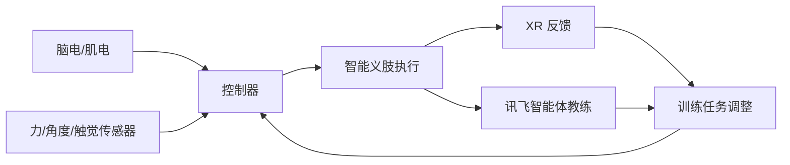
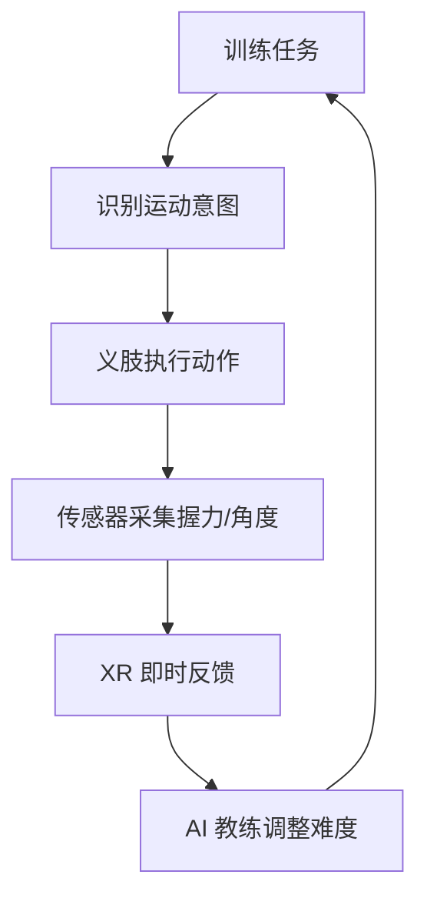
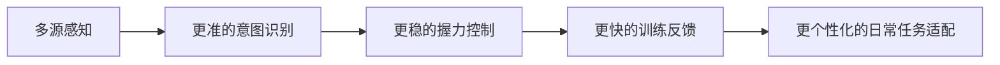

# 智能义肢/智能假肢训练系统视觉规划

输出角色：智能义肢方案视觉/绘图 agent  
使用边界：本目录只提供无文字视觉底图、生成图提示词、构图建议和流程图建议。PPT 中所有标题、标签、参数、界面文案均建议由主 agent 用可编辑文本和形状重排，避免图片内错字。

## 已生成关键图

1. `01_user_wearing_smart_prosthesis_xr.png`  
   用途：用户佩戴智能义肢抓取杯子/工具，XR 标出意图和力反馈。适合封面、技术方案交互页。

2. `02_textfree_architecture_base.png`  
   用途：脑电/肌电/传感器 -> 控制器 -> 义肢 -> XR/AI 教练的无文字架构底图。适合主 agent 叠加可编辑标签。

3. `03_3d_printed_modular_prosthesis_parts.png`  
   用途：3D 打印定制外壳和模块化握持端。已改为 CAD 白模风格，避免装饰面板产生伪文字。

## 全局视觉规范

- 画幅：优先 16:9 横版，便于直接铺 PPT。
- 文字：生成图中不要出现任何文字、数字、伪文字、品牌标识、UI 标签；文字全部用 PPT 可编辑文本叠加。
- 色彩编码：青色表示意图/数据流，琥珀色表示力反馈/触觉反馈，绿色表示状态通过，白色/石墨黑表示硬件主体。
- 视觉风格：真实产品原型 + 教育技术示意，不要做成科幻武器、医疗恐怖或广告大片。
- 叠加建议：在 PPT 中用半透明箭头、圆环、力反馈热区、简洁图标做信息层，底图保持干净。

## 建议 PPT 页视觉规划

### 1. 封面：智能义肢训练系统

需要的图：佩戴智能义肢抓取杯子的强视觉底图，可直接使用 `01_user_wearing_smart_prosthesis_xr.png`。  
构图：义肢和杯子位于画面中心偏右，左上留空放标题；XR 圆环围绕杯子和手指，表达“意图识别 + 力反馈”。  
避免错误：不要让图片生成标题字；不要出现畸形手指、过多机械臂、武器化外观、医院压抑氛围。

中文 prompt：
```text
横版 16:9，现代康复实验室中，一位用户佩戴智能义肢手臂轻握陶瓷杯，桌面有简单工具，画面真实、干净、专业。义肢为黑白石墨色 3D 打印外壳和金属关节，手指贴合杯壁。用青色半透明 XR 圆环、意图箭头、力反馈热区表示训练反馈。左上留出干净空白给 PPT 标题。不要任何文字、数字、logo、伪界面文字、水印。
```

English prompt:
```text
Landscape 16:9, a realistic user wearing an advanced smart prosthetic forearm gently grasping a ceramic cup in a modern rehabilitation lab. Clean professional educational style, graphite and white 3D-printed shell, metal joints, fingers naturally contacting the cup. Add subtle cyan XR rings, intention arrows, and force-feedback heat zones. Leave clean negative space in the upper left for editable PPT title. No readable text, no numbers, no logos, no pseudo UI text, no watermark.
```

### 2. 背景：从“替代肢体”到“可训练智能伙伴”

需要的图：一张轻量背景拼贴或分栏图，左侧为日常抓握场景，右侧为课堂/创客空间/XR 训练环境。  
构图：左右对比但不要“失败/成功”过度戏剧化；中间可用可编辑箭头写“智能化、个性化、可训练”。  
避免错误：不要出现真实患者伤口、残肢细节；不要生成统计数字；不要将 XR 做成游戏化过强。

中文 prompt：
```text
横版 16:9，教育展示风格的双场景拼贴：左侧是日常生活中需要稳定抓握杯子、钥匙、工具的桌面场景；右侧是明亮的课程创客空间，有 XR 眼镜、可穿戴传感器、3D 打印原型和学生调试设备。整体温暖、真实、积极，留出顶部空白。不要任何文字、数字、logo、界面文案、水印。
```

English prompt:
```text
Landscape 16:9 educational split-scene collage: on the left, everyday objects that require stable grasping such as a cup, keys, and a small tool on a desk; on the right, a bright classroom maker space with XR glasses, wearable sensors, a 3D-printed prosthetic prototype, and students tuning equipment. Warm, realistic, positive mood, with top negative space. No text, numbers, logos, UI copy, or watermark.
```

### 3. 问题：传统假肢训练反馈慢、难个性化

需要的图：用户尝试抓杯/工具时，画面用抽象符号表现“力过大/过小、意图不清、训练反馈滞后”。  
构图：主体动作放中间，三种问题用 PPT 后期叠加的图标气泡表示：意图识别、握力控制、训练反馈。  
避免错误：不要在图中生成“error”等文字；不要做成失败摔杯子的夸张灾难场景；不要加入医疗恐惧元素。

中文 prompt：
```text
横版 16:9，用户佩戴义肢尝试抓取杯子和小工具，动作略显谨慎，画面中用无文字的红橙色警示圆环、虚线、轻微错位箭头表达握力不稳定和反馈延迟。背景为干净训练桌面。留出右侧空白供 PPT 放置三个问题点。不要任何文字、数字、logo、伪界面、水印。
```

English prompt:
```text
Landscape 16:9, a user with a prosthetic hand carefully trying to grasp a cup and a small tool on a clean training desk. Use text-free red-orange warning rings, dashed paths, and slightly offset arrows to imply unstable grip force and delayed feedback. Leave empty space on the right for three editable problem points in PPT. No text, numbers, logos, pseudo UI, or watermark.
```

### 4. 技术方案总览：多源感知到闭环训练

需要的图：架构图，可直接使用 `02_textfree_architecture_base.png` 作为底图。  
构图：左侧放脑电/肌电/可穿戴传感器，中间放控制器，右侧放义肢，右上/右下放 XR 与 AI 教练，底部回流箭头表示训练反馈。  
避免错误：不要让图片生成标签；不要让箭头交叉太多；不要加入复杂电路原理图导致看不清。

中文 prompt：
```text
横版 16:9，干净无文字技术架构底图：左侧是脑电头带、肌电袖套和传感器节点，中间是空白控制器模块，右侧是智能义肢手，右上是 XR 眼镜，右下是友好的 AI 教练头像。用青色箭头表示信号流，用琥珀色回路箭头表示训练反馈。背景浅色网格，保留每个模块附近的空白供 PPT 后期加可编辑标签。绝对不要文字、数字、伪文字、logo、水印。
```

English prompt:
```text
Landscape 16:9, clean text-free technical architecture base image: EEG headband, EMG sleeve, and sensor nodes on the left; a blank central controller module; a smart prosthetic hand on the right; XR glasses in the upper right; a friendly AI coach avatar in the lower right. Cyan arrows for signal flow and amber loop arrows for training feedback. Light grid background, with blank label space near each module for editable PPT labels. Absolutely no text, numbers, pseudo text, logos, or watermark.
```

可复用流程图建议：


### 5. 技术方案细节：XR + AI 教练训练闭环

需要的图：佩戴场景或半身训练场景，可复用 `01_user_wearing_smart_prosthesis_xr.png`，主 agent 叠加 4 步训练闭环。  
构图：左侧为用户动作，右侧为可编辑的竖向流程：识别意图、提示动作、反馈握力、调整难度。  
避免错误：不要生成含错字的 XR 面板；不要把 AI 教练做成占画面过大的卡通角色；不要让界面遮住义肢接触点。

中文 prompt：
```text
横版 16:9，智能义肢训练场景：用户佩戴义肢在桌面练习抓取杯子和螺丝刀，XR 眼镜或半透明视野中出现无文字的动作轨迹、力反馈圆环和完成度进度形状。旁边有小型 AI 教练头像或光效节点，但不显示任何文字。右侧保留空白供 PPT 放置训练闭环。不要文字、数字、logo、伪界面、水印。
```

English prompt:
```text
Landscape 16:9 smart prosthesis training scene: a user practices grasping a cup and screwdriver with a prosthetic hand. XR view shows text-free motion paths, force-feedback rings, and progress shapes. A small AI coach avatar or light node appears nearby without any words. Leave blank space on the right for an editable training loop. No text, numbers, logos, pseudo UI, or watermark.
```

可复用流程图建议：


### 6. 技术方案细节：混元 3D + 3D 打印 + 模块化握持端

需要的图：可直接使用 `03_3d_printed_modular_prosthesis_parts.png`。  
构图：外壳在左，连接环和三类握持端从左到右排列；顶部空白放标题，底部可用 PPT 形状标注“定制外壳、快拆接口、杯握、工具夹、手指模块”。  
避免错误：不要生成面板文字、刻度尺、切割垫、品牌标识；不要让握持端像武器；不要出现不可制造的悬浮结构。

中文 prompt：
```text
横版 16:9，简洁 CAD 白模风格，展示 3D 打印智能义肢套件：左侧是白色有机晶格结构前臂外壳，中间是空白快拆连接环，右侧依次是机械手模块、圆柱杯握模块、工具夹模块。纯浅灰背景，棚拍光影，表面只有几何结构和材料纹理，没有任何电子面板、文字、数字、logo、刻度、工具或背景道具。
```

English prompt:
```text
Landscape 16:9, clean CAD clay-render style showing a 3D-printed smart prosthesis kit: a white organic lattice forearm shell on the left, a blank quick-release connector ring in the middle, then a robotic hand module, cylindrical cup-grip module, and tool-clamp module on the right. Seamless light-gray studio background, soft product lighting. Surfaces show only geometry and material texture, with no electronics panels, text, numbers, logos, measurement marks, tools, or background props.
```

可复用流程图建议：


### 7. 预期成效：训练更快、更稳、更个性化

需要的图：建议用 PPT 可编辑图表为主，底图只放无文字的三格成果场景：稳定握杯、工具操作、XR 完成反馈。  
构图：三张小场景横排，下面由主 agent 加指标卡：训练时间、握力稳定性、日常任务完成率、用户舒适度。  
避免错误：不要让生成图内出现百分比、数字、图表文字；不要承诺医疗疗效；不要用夸张对比。

中文 prompt：
```text
横版 16:9，三格无文字成果场景：第一格智能义肢稳定握住杯子，第二格夹持螺丝刀或勺子，第三格 XR 视野中以绿色圆环和勾形几何符号表示训练完成。整体明亮、真实、积极。每格留出空白供 PPT 添加可编辑指标。不要文字、数字、logo、伪界面、水印。
```

English prompt:
```text
Landscape 16:9, three text-free outcome scenes: first, a smart prosthetic hand steadily holding a cup; second, holding a screwdriver or spoon; third, an XR view with green rings and check-like geometric shapes indicating completion. Bright realistic positive style, with blank space in each panel for editable PPT metrics. No text, numbers, logos, pseudo UI, or watermark.
```

可复用流程图建议：


### 8. 课程收获：把四类课程技术串成产品原型

需要的图：四象限无文字图标或简洁场景：混元 3D/3D 打印、讯飞智能体、XR、BrainCo/可穿戴。  
构图：中间放智能义肢小模型，四周用四个可编辑象限或环形节点连接；主 agent 后期加文字说明课程收获。  
避免错误：不要生成课程名或品牌名文字；不要把 BrainCo/讯飞 logo 画进图里；不要让图标风格混乱。

中文 prompt：
```text
横版 16:9，教育总结页无文字视觉：中心是简洁智能义肢原型，四周环绕四个图标式场景节点：3D 建模与 3D 打印、AI 智能体教练、XR 眼镜训练、脑电/肌电可穿戴传感器。用青色和琥珀色连线连接成产品创新闭环。浅色背景，大量留白。不要任何文字、数字、logo、品牌标识、伪界面、水印。
```

English prompt:
```text
Landscape 16:9, text-free educational summary visual: a simple smart prosthesis prototype in the center, surrounded by four icon-like scene nodes for 3D modeling and 3D printing, AI coach agent, XR glasses training, and EEG/EMG wearable sensors. Cyan and amber lines connect them into a product innovation loop. Light background, generous whitespace. No text, numbers, logos, brand marks, pseudo UI, or watermark.
```

## 流程图复用模板

### A. 技术架构总图

适合放在“技术方案总览”。主 agent 可用可编辑形状重画，不建议把文字烘焙进图片。

```text
脑电/肌电/可穿戴传感器
    -> 信号预处理/意图识别控制器
    -> 电机/执行器驱动
    -> 智能义肢抓握
    -> 力/角度/触觉传感器回传
    -> XR 可视反馈 + 讯飞智能体训练建议
    -> 个性化参数更新
```

### B. 课程技术映射图

```text
混元 3D：生成外壳造型与模块概念
3D 打印：快速制造个性化外壳和接口件
BrainCo/可穿戴：采集脑电、肌电、姿态或训练状态
XR：把意图、力反馈、动作轨迹可视化
讯飞智能体：记录训练表现，给出语音/文本教练建议
```

### C. 训练闭环图

```text
任务选择 -> 用户尝试 -> 传感器采集 -> 意图识别 -> 义肢执行 -> XR 即时反馈 -> AI 教练评价 -> 参数/难度更新
```

## 生成图统一负面提示词

中文：
```text
不要任何文字、数字、伪文字、logo、品牌标识、水印；不要错误手指数量、畸形手、武器化外观、血腥医疗场景、杂乱背景、错误电线连接、过度科幻、看不清的小图表、不可编辑的界面文字。
```

English:
```text
No text, numbers, pseudo text, logos, brand marks, or watermark. Avoid wrong finger counts, deformed hands, weapon-like appearance, graphic medical imagery, cluttered background, impossible wiring, excessive sci-fi styling, tiny unreadable charts, and non-editable UI text.
```
