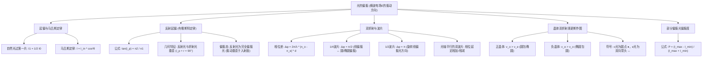

# 光的偏振考前突破急救教案

本教案专为大学物理2（波动光学与近代物理）期末冲刺设计，系统梳理**偏振片与马吕斯定律、布儒斯特定律、双折射与波片、惠更斯晶体作图、部分偏振度**这五大核心考点。结合清华期末真题与常见陷阱，助你考前快速拿分。

---

## 0. 光的偏振极速思维导图



---

## 1. 偏振片与马吕斯定律（强度过滤）

### 核心物理图像
* **线偏振光**：电场矢量 $\vec{E}$ 仅在单一固定方向振动。
* **自然光**：无数个振幅相等、振动方向均匀分布的线偏振光的无规叠加。
* **透振方向（偏振化方向）**：偏振片只允许平行于该方向的电场分量 $\vec{E}$ 通过。

### 核心公式与物理推导
1. **自然光通过第一块偏振片**：
   $$I_1 = \frac{1}{2} I_0$$
   * *原理解析*：自然光在所有方向振动概率均等，在透振方向和垂直透振方向投影的平均值恰好各占一半，因此透过强度减半。

2. **线偏振光通过偏振片（马吕斯定律）**：
   $$I = I_{\text{in}} \cos^2\theta$$
   * *原理解析*：若入射线偏振光的电场振幅为 $E_{\text{in}}$，与偏振片透振方向的夹角为 $\theta$，则透过偏振片的电场振幅分量为 $E = E_{\text{in}}\cos\theta$。因为光强 $I \propto E^2$，所以出射光强为 $I = I_{\text{in}}\cos^2\theta$。

### 考场避坑与保分技巧
> [!IMPORTANT]
> 1. **“第一块偏振片”定律**：无论入射自然光的光强是多少，只要它过了**第一块**偏振片，光强直接**砍半**，并且变成**线偏振光**。
> 2. **夹角 $\theta$ 的定义**：$\theta$ 是**入射线偏振光的振动方向**与**该偏振片透振方向**的夹角，而不是偏振片与光轴或水平面的夹角。

### 典型期末真题演练
**题目**：强度为 $I_0$ 的自然光垂直通过三块偏振片 $P_1, P_2, P_3$。已知 $P_1$ 与 $P_2$ 的透振方向夹角为 $30^\circ$，$P_1$ 与 $P_3$ 的透振方向垂直。求最终出射的光强。

**解题步骤**：
1. 自然光 $I_0$ 垂直通过第一片 $P_1$ 后，变为线偏振光，强度为：
   $$I_1 = \frac{1}{2}I_0$$
   此时光的偏振方向平行于 $P_1$ 的透振方向。
2. 光线通过第二片 $P_2$。因为 $P_1$ 与 $P_2$ 夹角为 $30^\circ$，根据马吕斯定律：
   $$I_2 = I_1 \cos^2 30^\circ = \frac{1}{2}I_0 \times \left(\frac{\sqrt{3}}{2}\right)^2 = \frac{3}{8}I_0$$
   此时出射光的偏振方向平行于 $P_2$ 的透振方向。
3. 光线通过第三片 $P_3$。因为 $P_1 \perp P_3$，而 $P_1$ 与 $P_2$ 夹角为 $30^\circ$，所以 $P_2$ 与 $P_3$ 的夹角为 $90^\circ - 30^\circ = 60^\circ$。根据马吕斯定律：
   $$I_3 = I_2 \cos^2 60^\circ = \frac{3}{8}I_0 \times \left(\frac{1}{2}\right)^2 = \frac{3}{32}I_0$$
**答案**：$\frac{3}{32}I_0$

---

## 2. 反射起偏与布儒斯特定律（界面反射）

### 核心物理图像
当自然光以特定的入射角 $i_p$（布儒斯特角）从折射率为 $n_1$ 的介质射向折射率为 $n_2$ 的介质时，反射光将变为**完全线偏振光**，且其振动方向**垂直于入射面**（即平行于界面，在图纸上表现为圆点 $\bullet$）。

```
        入射自然光 (各向振动)
             \         / 反射光 (完全偏振，仅含垂直入射面的圆点 ●)
              \  i_p  /
               \     / 
   -------------\---/------------- 介质 1 (n1)
                 \ /
                  |
                  \  r  折射光 (部分偏振，以平行入射面箭头 ↔ 为主)
                   \
```

### 核心公式
1. **布儒斯特定律**：
   $$\tan i_p = \frac{n_2}{n_1}$$
2. **反射与折射的几何互余关系**：
   当入射角为 $i_p$ 时，反射光线与折射光线互相垂直：
   $$i_p + r = 90^\circ$$

### 考场避坑与保分技巧
> [!WARNING]
> 1. **谁除以谁**：注意分清 $\tan i_p = n_2/n_1$。其中 $n_1$ 是**光线入射**的介质，$n_2$ 是**光线折射**的介质。如果光从玻璃（$1.5$）射向水（$1.33$），则是 $1.33/1.5$。
> 2. **反射光与折射光的偏振态**：
>    * **反射光**：是**完全线偏振光**（电场振动垂直于入射面，用圆点 $\bullet$ 表示）。
>    * **折射光**：是**部分偏振光**（两种振动方向都有，但以平行于入射面的振动 $\leftrightarrow$ 为多）。

### 典型期末真题演练
**题目**：一束自然光以布儒斯特角由空气（$n_1=1$）射向某玻璃表面。已知折射角为 $30^\circ$。求玻璃的折射率 $n_2$。

**解题步骤**：
1. 根据布儒斯特定律，入射角 $i_p$ 与折射角 $r$ 满足几何关系：
   $$i_p + r = 90^\circ$$
2. 已知折射角 $r = 30^\circ$，则布儒斯特角为：
   $$i_p = 90^\circ - 30^\circ = 60^\circ$$
3. 代入布儒斯特公式：
   $$\tan i_p = \frac{n_2}{n_1} \implies \tan 60^\circ = \frac{n_2}{1} \implies n_2 = \sqrt{3} \approx 1.73$$
**答案**：$\sqrt{3}$（或 $1.73$）

---

## 3. 双折射与波片（相位延迟）

### 核心物理图像
当光垂直入射到单轴晶体波片时，光线会被分解为两束偏振方向互相垂直的相干光：
* **寻常光（o光，ordinary ray）**：振动方向垂直于晶体主截面，在各方向折射率均为常数 $n_o$。
* **非常光（e光，extraordinary ray）**：振动方向平行于晶体主截面，折射率随方向变化，但在垂直于光轴传播时，折射率为固定值 $n_e$。

由于 $n_o \neq n_e$，o光与e光在晶体中的传播速度不同，出射时便会产生一定的**光程差**和**相位差**。

### 核心公式
1. **相位差与厚度的关系**：
   若晶片厚度为 $d$，入射光真空波长为 $\lambda_0$，则出射时 o光 与 e光 的相位差为：
   $$\Delta\varphi = \frac{2\pi}{\lambda_0} |n_o - n_e| d$$

2. **四分之一波片（$\lambda/4$ 波片）**：
   * 厚度满足：$|n_o - n_e| d = (2k + 1)\frac{\lambda_0}{4}$（通常取 $k=0$）。
   * 相位差：$\Delta\varphi = \frac{\pi}{2}$。
   * 作用：偏振方向与光轴成 $45^\circ$ 的线偏振光通过后，变为**圆偏振光**；反之，圆偏振光通过后变为线偏振光。

3. **二分之一波片（$\lambda/2$ 波片）**：
   * 厚度满足：$|n_o - n_e| d = (2k + 1)\frac{\lambda_0}{2}$。
   * 相位差：$\Delta\varphi = \pi$。
   * 作用：使线偏振光的偏振方向发生旋转（出射光与入射光的偏振方向关于晶体光轴对称，旋转角为两倍的入射夹角 $2\theta$）。

### 考场避坑与保分技巧
> [!TIP]
> **波片组合（叠加）的“秒杀”技巧**：
> 两个光轴方向**相同（平行）**的波片叠放在一起，它们的相位差直接**相加**。
> * 例如：$\lambda/4$ 波片 + $\lambda/4$ 波片 = $\lambda/2$ 波片（总相位差为 $\pi/2 + \pi/2 = \pi$）。
> 两个光轴方向**互相垂直**的波片叠放在一起，它们的相位差直接**相减**。
> * 例如：同规格的 $\lambda/4$ 波片垂直叠加，总相位差为 $\pi/2 - \pi/2 = 0$，等效于没有波片。

### 典型期末真题演练（即考题第 10 题）
**题目**：$\lambda/4$ 波片 $P_1$ 和 $\lambda/4$ 波片 $P_2$ 的光轴方向相同。一束偏振方向与光轴成 $45^\circ$ 的线偏振光垂直经过 $P_1$ 后，其偏振方向与光轴夹角为___________；再经过 $P_2$ 后，变成___________光。

**解题步骤**：
1. 线偏振光入射至第一个 $\lambda/4$ 波片 $P_1$，夹角为 $45^\circ$。由于产生了 $\pi/2$ 的相位差且两垂直分量振幅相等，出射光为**圆偏振光**。圆偏振光的电场矢量端点随时间做圆周运动，**没有固定的偏振方向**。第一空填 `无固定方向` 或 `随时间改变`。
2. 因为 $P_1$ 和 $P_2$ 的光轴平行，总相位延迟直接累加：
   $$\Delta\varphi_{\text{total}} = \frac{\pi}{2} + \frac{\pi}{2} = \pi$$
   这等效于一个**二分之一波片**。
3. 线偏振光通过二分之一波片后，出射光仍为**线偏振光**（偏振方向旋转了 $2 \times 45^\circ = 90^\circ$，即与光轴夹角依然为 $45^\circ$）。第二空填 `线偏振`。
**答案**：无固定方向； 线偏振

---

## 4. 单轴晶体双折射的惠更斯作图法（绘图专题）

作图题属于“送分题”，只要掌握**正负晶体**以及**画o/e子波包络面**的规律，即可拿满分。

### 核心物理规律
1. **o光子波面**：在晶体中各方向速度相同，子波面恒为**圆**。
2. **e光子波面**：在晶体中各方向速度不同，子波面为**旋转椭圆**。
3. **正负晶体判定**：
   * **正晶体**（如石英）：$v_o > v_e$，在晶体中 o光传播得比 e光快，因而**“圆包椭圆”**。它们在光轴方向相切。
   * **负晶体**（如冰洲石）：$v_e > v_o$，在晶体中 e光传播得比 o光快，因而**“椭圆包圆”**。它们在光轴方向相切。

```
       【正晶体 (圆包椭圆)】               【负晶体 (椭圆包圆)】
             光轴                             光轴
              |                                |
           .-----.                          .-----.
         /  .---.  \                      /  .---.  \
        |  |  e  |  |                    |  |  o  |  |
        |  |     |  | (o光圆在外)        |  |     |  | (e光椭圆在外)
        |  |  o  |  |                    |  |  e  |  |
         \  '---'  /                      \  '---'  /
           '-----'                          '-----'
```

### 作图四步法
1. **画入射波前与子波源**：在晶体表面选取若干点作为惠更斯子波的波源。
2. **画子波面**：
   * o光画圆，半径为 $v_o \Delta t$。
   * e光画椭圆（长短轴由正负晶体及光轴方向决定），正晶体椭圆在圆内，负晶体椭圆在圆外，且在光轴方向椭圆与圆相切。
3. **画切线与折射光线**：作圆和椭圆的公切线（包络面即折射波前）。连接波源（入射点）与切点的连线，即为折射光线（o光与e光）。
4. **标注偏振符号**：
   * **o光** 的电场振动垂直于主截面，在图纸上用**圆点（$\bullet$）**表示。
   * **e光** 的电场振动平行于主截面，在图纸上用**双向箭头或短线（$\leftrightarrow$）**表示。

---

## 5. 部分偏振光的偏振度（测量与计算）

### 核心物理图像
部分偏振光可以看作是**线偏振光**与**自然光**的混合。如果用一个偏振片去迎着部分偏振光旋转，当透振方向与线偏振分量平行时，透射光强最大为 $I_{\text{max}}$；当透振方向与线偏振分量垂直时，透射光强最小为 $I_{\text{min}}$（此时透过的只有自然光的一半分量）。

### 核心公式
* **偏振度 $P$**：
  $$P = \frac{I_{\text{max}} - I_{\text{min}}}{I_{\text{max}} + I_{\text{min}}}$$
  * 对于**完全线偏振光**：$I_{\text{min}} = 0 \implies P = 1$。
  * 对于**自然光**：$I_{\text{max}} = I_{\text{min}} \implies P = 0$。

### 典型期末真题演练
**题目**：一束部分偏振光垂直通过偏振片，旋转偏振片一周，测得透射光强的最大值为最小值的 3 倍。求这束光的偏振度。

**解题步骤**：
1. 设透射光强最小值为 $I_{\text{min}} = I_0$，则最大值为 $I_{\text{max}} = 3I_0$。
2. 代入偏振度公式：
   $$P = \frac{I_{\text{max}} - I_{\text{min}}}{I_{\text{max}} + I_{\text{min}}} = \frac{3I_0 - I_0}{3I_0 + I_0} = \frac{2I_0}{4I_0} = 0.5 = 50\%$$
**答案**：$0.5$（或 $50\%$）

---

## 6. 考前公式极速自测表

| 物理情境 | 待求物理量 | 极速秒杀公式 |
|---|---|---|
| 自然光 $I_0$ 垂直通过单块偏振片 | 透射光强 $I$ | $I = \frac{1}{2}I_0$ |
| 线偏振光 $I_{\text{in}}$ 过偏振片（夹角 $\theta$） | 透射光强 $I$ | $I = I_{\text{in}}\cos^2\theta$ |
| 自然光由介质1射向介质2，反射光完全偏振 | 入射角（布儒斯特角） $i_p$ | $\tan i_p = \frac{n_2}{n_1}$ |
| 布儒斯特角入射时反射光与折射光的关系 | 几何夹角 | $i_p + r = 90^\circ$ |
| 单轴晶体波片厚度为 $d$，产生相位延迟 | o光与e光相位差 $\Delta\varphi$ | $\Delta\varphi = \frac{2\pi}{\lambda_0}|n_o - n_e|d$ |
| 旋转偏振片测量部分偏振光 | 偏振度 $P$ | $P = \frac{I_{\text{max}} - I_{\text{min}}}{I_{\text{max}} + I_{\text{min}}}$ |
