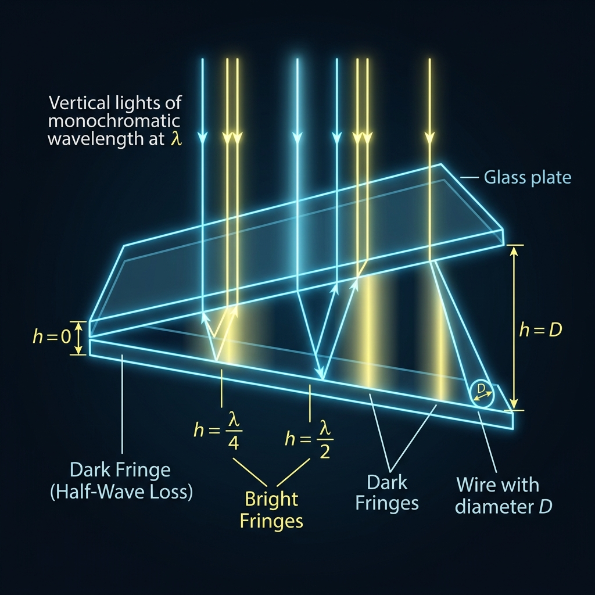

# 大物公式极速默写与考前冲刺提卡 (2026-06-23)

本文归纳整理了 2026-06-23 进行的三轮大物公式默写测试。包含题目、你的回答、正确答案以及考场避坑的深度剖析，以便随时翻看复习。

---

## 📅 第一轮（Round 1）

### 📝 第一题：空间相干性极限 (光的干涉)
* **题目**：当光源宽度为 $b$，双缝间距为 $d$，波长为 $\lambda$ 时，要想在屏上看到干涉条纹，光源到双缝的距离 $R$ 必须满足什么极限不等式条件？
* **你的回答**：$R$ 必须大于等于 $b \cdot d / \lambda$（口诀：R拉姆等于东北，即 $R\lambda = bd$）。其中 $d$ 为双缝间距，$b$ 为光源宽度，$\lambda$ 为波长。
* **正确答案**：
  $$ R \ge \frac{bd}{\lambda} $$
* **考点避坑**：
  1. 字母含义绝对不要记混：$R$ 是**光源到双缝**的距离，而非双缝到屏的距离。
  2. 极限是**大于等于**（光源不能靠双缝太近，越远空间相干性越好）。

---

### 📝 第二题：光栅缺级条件 (光的衍射)
* **题目**：设光栅常数为 $d$，单缝宽度为 $a$。当发生“缺级”时，光栅衍射的主极大级数 $k$ 和单缝衍射的暗纹级数 $m$ 满足什么比例公式？
* **你的回答**：$ak = dm$（比例关系 $\frac{k}{m} = \frac{d}{a}$）。
* **正确答案**：
  $$ a k = d m \implies k = \frac{d}{a} m \quad (m = \pm 1, \pm 2, \dots) $$
* **考点避坑**：
  1. 口诀速记：“爱看动漫/AK等于DM”。
  2. **重要定义**：光栅常数 $d$ 代表**相邻两个缝中心之间的距离**，其值为透光宽度 $a$ 与不透光宽度 $b$ 之和（即 $d = a + b$）。如果题目给出 $a$ 和 $b$，必须相加后代入！

---

### 📝 第三题：马吕斯定律 (光的偏振)
* **题目**：一束光强为 $I_0$ 的**自然光**，垂直穿过两块偏振片。已知这两块偏振片的透光轴夹角为 $\alpha$。求最终出射的光强 $I$ 满足什么公式？
* **你的回答**：自然光过第一块变成 $\frac{1}{2}I_0$，第二块为 $\frac{1}{2}I_0 \cos^2\alpha$。
* **正确答案**：
  $$ I = \frac{1}{2} I_0 \cos^2\alpha $$
* **考点避坑**：
  自然光（无偏振）过第一块偏振片（起偏器）后，光强会**直接减半**，变为线偏振光。只有在过第二块偏振片（检偏器）时，才需要套用 $\cos^2\alpha$。

---

### 📝 第四题：德布罗意波长速记 (量子物理)
* **题目**：一个质量为 $m_e$、电荷量为 $e$ 的静止电子，在加速电压 $U$ 下加速（不考虑相对论效应）。它的德布罗意波长 $\lambda$ 与电压 $U$ 的关系式是什么？秒杀公式是什么？
* **你的推导**：
  由 $eU = \frac{p^2}{2m_e} \implies p = \sqrt{2m_e eU}$。
  代入德布罗意公式 $\lambda = \frac{h}{p}$，得到：
  $$ \lambda = \frac{h}{\sqrt{2m_e eU}} $$
* **秒杀公式**：
  $$ \lambda \approx \frac{1.226}{\sqrt{U}} \text{ nm} \quad \text{或} \quad \lambda \approx \sqrt{\frac{150}{U}} \text{ \AA} $$
* **考点避坑**：
  选择填空题中遇到“100V 加速电压”等具体数值时，直接代入速记公式，例如 $\sqrt{150/100} = 1.226\text{ \AA} = 0.1226\text{ nm}$，可避免繁杂常数计算。

---

## 📅 第二轮（Round 2）

### 📝 第五题：薄膜干涉与半波损失
* **题目**：一薄膜厚度为 $e$，折射率为 $n_2$，垂直入射：
  1. 若折射率满足 $n_1 < n_2 < n_3$，反射光光程差 $\delta$ 公式是什么？
  2. 若折射率满足 $n_1 < n_2 > n_3$，反射光光程差 $\delta$ 公式是什么？
* **你的回答**：
  1. $n_1 < n_2 < n_3$：上表面和下表面都有半波损失，抵消，光程差为 $2n_2e$。
  2. $n_1 < n_2 > n_3$：只有一个表面有半波损失，光程差为 $2n_2e - \frac{\lambda}{2}$（或加 $\frac{\lambda}{2}$）。
* **正确答案**：
  1. $n_1 < n_2 < n_3 \implies \delta = 2n_2 e$
  2. $n_1 < n_2 > n_3 \implies \delta = 2n_2 e \pm \frac{\lambda}{2}$
* **考点避坑**：
  只要反射介质是**从光疏到光密**（折射率小射向折射率大），就会在反射点产生 $\frac{\lambda}{2}$ 的半波损失。两面都有或两面都没有则抵消。

---

### 📝 第六题：劈尖测微（测细丝直径 $D$）
* **题目**：两玻璃板夹直径为 $D$ 的细丝形成空气劈尖，单色光波长为 $\lambda$，若数得明纹总数为 $N$ 个，写出直径 $D$ 公式。
* **你的回答**：最简单写法是 $D = N\frac{\lambda}{2}$，更精细的区别求讲解。
* **精细化对齐剖析**：
  由于空气劈尖在最左端接触点（厚度 $h=0$）必然是一条**暗纹**：

  

  1. 若已知**暗纹**总数（包括接触线）为 $N$ 个，则：
     $$ D = (N - 1) \frac{\lambda}{2} $$
  2. 若已知**明纹**总数为 $N$ 个，则：
     $$ D = (2N - 1) \frac{\lambda}{4} $$

---

### 📝 第七题：迈克耳孙干涉仪插介质片
* **题目**：在迈克耳孙干涉仪的一臂中插入折射率为 $n$、厚度为 $e$ 的介质片，产生的额外光程差改变量是多少？
* **你的回答**：因为光往返走两次，所以光程差改变量是 $2(n-1)e$。
* **正确答案**：
  $$ \Delta \delta = 2(n-1)e $$
* **考点避坑**：
  普通的薄膜插入光程差是 $(n-1)e$，但迈克耳孙干涉仪的动臂/静臂光路是**反射式**的，光往返经过介质片，所以必须乘以 2。

---

### 📝 第八题：光栅最高级数与条纹总数
* **题目**：已知光栅常数为 $d$，单色光波长为 $\lambda$。
  1. 最大级数 $k_{max}$ 满足的条件？
  2. 若 $k_{max} = 3.2$，且无缺级，屏幕上能看到的明条纹总数是多少？
* **你的回答**：
  1. $k_{max} \le \frac{d}{\lambda}$（源于 $\sin\theta \le 1$）。
  2. $k_{max} = 3.2$ 取最大整数为 3。由于中央为 0 级，左右对称分布，总条纹数是 $2(3) + 1 = 7$ 条。
* **正确答案**：
  1. $k \le \frac{d}{\lambda}$ 
  2. $N_{total} = 2k_{max\_int} + 1 = 7$ 条。

---

### 📝 第九题：布儒斯特定律 (光的偏振)
* **题目**：自然光以布儒斯特角 $i_b$ 从 $n_1$ 射入 $n_2$ 时，反射角与折射角关系以及正切公式？
* **你的回答**：$i_b + r = 90^\circ$ 且 $\tan i_b = \frac{n_2}{n_1}$。
* **正确答案**：
  $$ i_b + r = 90^\circ \quad \text{且} \quad \tan i_b = \frac{n_2}{n_1} $$
* **考点避坑**：
  1. 此时反射光是**完全线偏振光**，其振动方向**垂直于入射面**。
  2. 折射光是**部分偏振光**。

---

## 📅 第三轮（Round 3）

### 📝 第十题：偏振片三明治经典题（光的偏振）
* **题目**：三块偏振片叠放。第一块 $P_1$ 与第三块 $P_3$ 透光轴**相互垂直**。第二块 $P_2$ 插入中间且与 $P_1$ 夹角为 $\theta$。强度为 $I_0$ 的自然光垂直入射，求最终透射光强 $I_3$。
* **正确解答**：
  1. 自然光过 $P_1$（线偏振光）：$I_1 = \frac{1}{2} I_0$。
  2. 线偏振光过 $P_2$（夹角为 $\theta$）：由马吕斯定律，$I_2 = I_1 \cos^2\theta = \frac{1}{2} I_0 \cos^2\theta$。
  3. 线偏振光过 $P_3$：由于 $P_1 \perp P_3$，而 $P_2$ 与 $P_1$ 夹角为 $\theta$，所以 $P_2$ 与 $P_3$ 的夹角为 $90^\circ - \theta$。
     再次套用马吕斯定律：
     $$ I_3 = I_2 \cos^2(90^\circ - \theta) = I_2 \sin^2\theta = \frac{1}{2} I_0 \cos^2\theta \sin^2\theta $$
     *(也可以写成：$I_3 = \frac{1}{8} I_0 \sin^2(2\theta)$)*
* **考场避坑**：
  第二块与第三块的夹角一定是 $90^\circ - \theta$，不要直接代入 $\theta$。如果夹角 $\theta = 45^\circ$，出射光强最大，为 $\frac{1}{8} I_0$。

---

### 📝 第十一题：光电效应方程（量子物理）
* **题目**：光子频率为 $\nu$，金属逸出功为 $A$，最大初动能 $E_{km}$ 与遏止电压 $U_c$ 的关系公式？
* **正确解答**：
  1. 爱因斯坦光电效应方程：
     $$ h\nu = A + E_{km} \implies E_{km} = h\nu - A $$
  2. 遏止电压关系式：
     $$ E_{km} = e U_c \implies U_c = \frac{h\nu - A}{e} $$
* **考场避坑**：
  红限频率（截止频率） $\nu_0$ 满足 $h\nu_0 = A$，所以在没有给出 $A$ 时，逸出功常表示为 $h\nu_0$。

---

### 📝 第十二题：不确定关系 (量子物理)
* **题目**：粒子在 $x$ 方向上的位置不确定量 $\Delta x$ 与动量不确定量 $\Delta p_x$ 的不确定关系式？
* **正确解答**：
  $$ \Delta x \cdot \Delta p_x \ge \frac{\hbar}{2} \quad \left( \text{或} \ \ge \frac{h}{4\pi} \right) $$
* **考场避坑**：
  常数是 $\frac{\hbar}{2}$，其中约化普朗克常数 $\hbar = \frac{h}{2\pi}$。如果用普朗克常数 $h$ 表示，右边是 $\frac{h}{4\pi}$。切忌记成 $\hbar$ 或 $h$。

---

## 📅 第四轮（Round 4）

### 📝 第十三题：康普顿散射波长偏移
* **题目**：
  1. 请写出康普顿波长偏移量 $\Delta \lambda$ 的计算公式（用散射角 $\theta$ 表示）。
  2. 常数项（康普顿波长） $\lambda_c = \frac{h}{m_e c}$ 的大概数值是多少纳米（$\text{nm}$）？
* **你的回答**：
  1. 偏移量是 $\lambda_c (1 - \cos\theta)$。
  2. 康普顿波长数值想不起来了。
* **正确答案**：
  1. $\Delta \lambda = \lambda_c(1 - \cos\theta) = \frac{h}{m_e c}(1 - \cos\theta)$
  2. $\lambda_c \approx 0.0024 \text{ nm}$ （即 $2.43 \times 10^{-12} \text{ m}$，或 $0.024 \text{ \AA}$）
* **考点避坑**：
  1. 散射角 $\theta$ 是**散射光子与入射光子原前进方向的夹角**。
  2. 康普顿波长 $\lambda_c$ 是一个极小的常数（约千分之二点四纳米），通常试卷常数表上会直接提供，但记住其量级在选择题很有帮助。

---

### 📝 第十四题：一维定态薛定谔方程
* **题目**：微观粒子质量为 $m$，所处外场势能为 $U(x)$，总能量为 $E$。请写出一维定态薛定谔方程。
* **你的回答**： $-\frac{\hbar^2}{2m} \frac{\mathrm{d}^2\psi}{\mathrm{d}x^2} + U\psi = E\psi$ （使用约化普朗克常数 $\hbar$）。
* **正确答案**：
  $$ -\frac{\hbar^2}{2m} \frac{\mathrm{d}^2\psi}{\mathrm{d}x^2} + U\psi = E\psi $$
* **考点避坑**：
  1. 左端第一项的分母是 $2m$，分子是 $\hbar^2$（约化普朗克常数平方），且有**负号**。
  2. 记住动能算符的形式：$\hat{T} = -\frac{\hbar^2}{2m}\frac{\mathrm{d}^2}{\mathrm{d}x^2}$。

---

### 📝 第十五题：一维无限深方势阱能级
* **题目**：
  1. 请写出粒子第 $n$ 能级能量 $E_n$ 的计算公式。
  2. 这里的量子数 $n$ 是从 0 开始取值，还是从 1 开始取值？
* **你的回答**：
  1. $E_n = n^2 \frac{h^2}{8ma^2}$。
  2. $n$ 必须从 1 开始取值。
* **正确答案**：
  1. $E_n = n^2 \frac{h^2}{8ma^2} = n^2 \pi^2 \frac{\hbar^2}{2ma^2} \quad (n = 1, 2, 3, \dots)$
  2. $n$ 必须从 1 开始取值。
* **考点避坑**：
  1. 为什么不能从 0 开始？因为如果 $n=0$，对应的波函数 $\psi_0(x) = \sqrt{\frac{2}{a}} \sin(0) = 0$ 处处为 0，意味着粒子根本不存在于势阱中。所以基态能量必须是 $n=1$。
  2. **能级与阱宽的平方成反比**！阱宽如果缩减到原来的 $\frac{1}{5}$，能级能量会暴增为原来的 $25$ 倍。

---

### 📝 第十六题：轨道角动量大小 (原子物理)
* **题目**：
  1. 电子轨道角动量大小 $L$ 的计算公式是什么？（用角量子数 $l$ 表示）
  2. 如果电子处于 $3d$ 状态，对应的角量子数 $l$ 是多少？轨道角动量 $L$ 的大小又是多少倍的 $\hbar$？
* **你的回答**：
  1. $L = \sqrt{l(l+1)}\hbar$。
  2. 对于 $3d$ 态，$n=3$，$l=2$。轨道角动量大小为 $\sqrt{6}\hbar$。
* **正确答案**：
  1. $L = \sqrt{l(l+1)}\hbar$
  2. 对于 $3d$ 态，主量子数 $n=3$，角量子数 $l=2$（对应 $s=0, p=1, d=2, f=3$）。其轨道角动量大小为 $L = \sqrt{2(2+1)}\hbar = \sqrt{6}\hbar$。
* **考点避坑**：
  1. 区分**轨道角动量大小 $L$** 与 **轨道角动量在 Z 轴的投影 $L_z$**：
     * 大小：$L = \sqrt{l(l+1)}\hbar$
     * 投影：$L_z = m_l\hbar \quad (|m_l| \le l)$
  2. $3d$ 状态中的“3”指的是主量子数 $n=3$，角量子数由字母“d”决定，绝对不要错写成 $l=3$！

