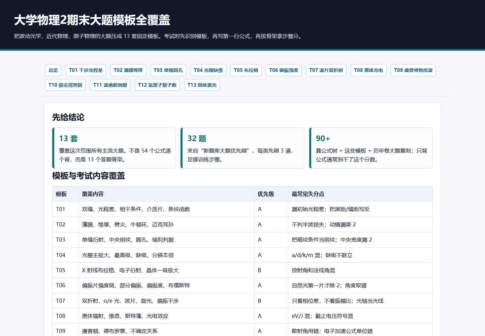

# 大学物理2期末大题模板全覆盖

> 把波动光学、近代物理、原子物理的大题压成 13 套固定模板。考试时先识别模板，再写第一行公式，再按骨架拿步骤分。

## 📸 模板大纲与思维全景图

以下是整理好的大题模板全景图，你可以随时查阅：



## 📅 考前必看提要

* **13 套** 覆盖这次范围所有主流大题。不是 54 个公式逐个背，而是 13 个答题骨架。
* **32 题** 来自“新题库大题优先刷”，每类先刷 3 道，足够训练步骤。
* **90+靠** 公式树 + 这些模板 + 历年卷大题复刻；只背公式通常到不了这个分数。

### 📊 模板与考点覆盖矩阵

| 模板 | 覆盖内容 | 优先级 | 最常见失分点 |
| --- | --- | --- | --- |
| T01 | 双缝、光程差、相干条件、介质片、条纹函数 | A | 漏初始光程差；把屏距/缝距写反 |
| T02 | 薄膜、等厚、劈尖、牛顿环、迈克耳孙 | A | 不判半波损失；动镜漏乘 2 |
| T03 | 单缝衍射、中央明纹、圆孔、瑞利判据 | A | 把暗纹条件当明纹；中央宽度漏 2 |
| T04 | 光栅主极大、最高级、缺级、分辨本领 | A | a/d/k/m 混；缺级不联立 |
| T05 | X 射线布拉格、电子衍射、晶体一级极大 | B | 掠射角和法线角混 |
| T06 | 偏振片强度链、部分偏振、偏振度、布儒斯特 | A | 自然光第一片才除 2；角度取错 |
| T07 | 双折射、o/e 光、波片、旋光、偏振干涉 | B | 只看相位差，不看振幅比；光轴当光线 |
| T08 | 黑体辐射、维恩、斯特藩、光电效应 | A | eV/J 混；截止电压符号混 |
| T09 | 康普顿、德布罗意、不确定关系 | A | 散射角用错；电子加速公式单位错 |
| T10 | 定态薛定谔方程、无限深势阱、能级、本征函数 | A | 不写边界条件；归一化漏系数 |
| T11 | 波函数展开、动量本征态、概率、平均值 | A | 把波函数本身当概率；概率振幅不平方 |
| T12 | 氢原子能级、里德伯、谱线条数、量子数 | A | 激发态 n 数错；量子数范围错 |
| T13 | 激光、能带、半导体、p-n 结、分子转动 | C | 偏概念题，背关键词比推导更重要 |

### 🔄 考场通用解题工作流

**圈关键词** → **选模板编号** → **写第一行公式** → **补判断条件** → **代入与单位** → **写结论**

---

## 📌 T01 干涉光程差 / 双缝 / 介质片 / 条纹函数 (A 必会)
锚点 ID: `t01`

### 🔍 识别信号

> **核心公式首发**：$\Delta\varphi=\frac{2\pi}{\lambda}\delta$，$\delta \approx d\sin\theta \approx \frac{dx}{D}$，$\Delta x=\frac{\lambda D}{d}$

* 双缝、两相干光源、光程差、相位差、相邻明纹、介质片、劳埃德镜。
* 题目让求条纹间距、中央明纹移动、第 k 级位置、某点光强函数。

### 🔍 满分骨架

```text
1. 建立等效双光源/双缝，写出几何光程差 δ。
2. 若有介质片，额外光程差 Δ=(n-1)e。
3. 明纹：δ=kλ；暗纹：δ=(k+1/2)λ。
4. 若求光强：先写 Δφ=2πδ/λ，再写 I=I1+I2+2√(I1I2)cosΔφ。
5. 代入单位，给出位置、级次或光强函数。
```

* **常见变形**：初始相位差/初始光程差、凸透镜切半等效双光源、星光双缝测角直径、相干长度/空间相干性。
* **易错点**：**中央明纹不是永远在 O 点**；有初始光程差时要写 $\delta \approx dx/D + \delta_0$。介质片移动条纹看 $(n-1)e=k\lambda$。
* **必刷原题**：题库 ID 5889、3182、3685；2020 秋计算 1；2022 春填空 3、16。

---

## 📌 T02 薄膜 / 等厚 / 劈尖 / 牛顿环 / 迈克耳孙 (A 必会)
锚点 ID: `t02`

### 🔍 第一行

> **核心公式首发**：先判半波损失；正入射薄膜几何光程差写 $2ne$。迈克耳孙写 $2\Delta d=N\lambda$。

* 等厚相邻厚度差：$\Delta e=\lambda/(2n)$
* 劈尖条纹间距：$l=\lambda/(2n\theta)$
* 牛顿环：$r_k^2=kR\lambda$ 或按明暗条件平移半级

### 🔍 满分骨架

```text
1. 写“观察反射光/透射光”，判断两束反射是否有半波损失差。
2. 写光程差：δ=2ne 或 δ=2ne±λ/2。
3. 按明纹/暗纹条件列式。
4. 等厚题把厚度差换成条纹间距；迈克耳孙题把动镜位移乘 2。
5. 代入求 e、λ、N、r、l，并注明明暗条件。
```

* **常见变形**：增透膜、油膜反射颜色、等厚条纹、平晶压细丝、牛顿环、动镜移动、介质片插入迈克耳孙光路。
* **易错点**：**半波损失会让亮暗条件互换**；迈克耳孙镜子移动 $\Delta d$，光程变 $2\Delta d$。
* **必刷原题**：题库 ID 5892、5887、5891；2020 秋填空 4、5；2022 春填空 6、14。

---

## 📌 T03 单缝衍射 / 圆孔 / 瑞利判据 (A 必会)
锚点 ID: `t03`

### 🔍 第一行

> **核心公式首发**：单缝暗纹：$a\sin\theta=k\lambda$。中央明纹线宽：$\Delta x_0=2f\lambda/a$。圆孔：$\theta_{\min}=1.22\lambda/D$。

### 🔍 满分骨架

```text
1. 判断是单缝还是圆孔。
2. 单缝题先找暗纹级次 k，不先找明纹。
3. 小角近似：sinθ≈tanθ≈x/f 或 x/D。
4. 中央明纹宽度是两侧一级暗纹之间，所以乘 2。
5. 圆孔/望远镜直接用瑞利判据，再换线距离或角距离。
```

* **常见变形**：中央明纹宽度、两种波长是否重合、望远镜/人眼分辨、夫琅禾费光强分布推导。
* **易错点**：单缝 $a$ 是缝宽；圆孔 $D$ 是孔径/口径。中央明纹半宽和全宽差一个 2。
* **必刷原题**：题库 ID 1771、1772、3211；2020 秋填空 3、6；2022 春填空 8、10。

---

## 📌 T04 光栅主极大 / 缺级 / 最高级 / 分辨本领 (A 必会)
锚点 ID: `t04`

### 🔍 第一行

> **核心公式首发**：主极大：$d\sin\theta=k\lambda$。缺级联立：$a\sin\theta=m\lambda$。分辨本领：$R=\lambda/\Delta\lambda=kN$。

### 🔍 满分骨架

```text
1. 写光栅常数 d；若题给每毫米 N 条，先换 d=1/N。
2. 主极大用 d sinθ=kλ。
3. 最高级用 |sinθ|≤1，列 kmax≤d/λ。
4. 缺级必须联立主极大和单缝暗纹，得 k=(d/a)m。
5. 分辨双线用 R=kN≥λ/Δλ。
```

* **常见变形**：斜入射光栅、最高级次、总谱线数、缺级序列、两条钠黄光分辨、N 缝中央强度 $N^2I_0$。
* **易错点**：**a 是缝宽，d 是光栅常数，k 是主极大级次，m 是单缝暗纹级次**。
* **必刷原题**：题库 ID 3531、5220、5755；2020 秋计算 2；2022 春计算 3。

---

## 📌 T05 布拉格 / X 射线 / 电子衍射 (B 补强)
锚点 ID: `t05`

### 🔍 第一行

> **核心公式首发**：布拉格：$2d\sin\varphi=k\lambda$。电子衍射先求 $\lambda=h/p$ 或 $\lambda=h/\sqrt{2meU}$。

### 🔍 满分骨架

```text
1. 圈出题给角度是“掠射角/晶面夹角”还是“法线角”。
2. 若是法线角，先换成 φ=90°-θ。
3. 写 2d sinφ=kλ。
4. 若是电子束，先由加速电压求德布罗意波长。
5. 代入求 d、λ、k 或角度。
```

* **常见变形**：一级极大、二级极大、已知晶面间距求波长、戴维孙-革末电子衍射。
* **易错点**：布拉格角是与晶面夹角，不是默认与法线夹角。
* **必刷原题**：题库 ID 1785、1786；2022 春填空 5；布拉格选择题 7953。

---

## 📌 T06 偏振片强度链 / 部分偏振 / 布儒斯特角 (A 必会)
锚点 ID: `t06`

### 🔍 第一行

> **核心公式首发**：自然光第一片：$I_1=I_0/2$。后续：$I=I_{\rm in}\cos^2\alpha$。偏振度：$P=(I_{\max}-I_{\min})/(I_{\max}+I_{\min})$。布儒斯特：$\tan i_B=n_2/n_1$。

### 🔍 满分骨架

```text
1. 判断入射光：自然光、线偏振光、部分偏振光。
2. 自然光第一次过偏振片才除以 2。
3. 之后每片都用相邻透振方向夹角乘 cos²。
4. 部分偏振拆成自然光 In 和线偏振光 Ip。
5. 布儒斯特题画法线，写 iB+r=90°。
```

* **常见变形**：两片/三片偏振片、混合光求自然光与线偏振光比例、反射完全偏振、折射角与反射角。
* **易错点**：**第一片除不除 2，只看入射是不是自然光**。线偏振题角度是“振动方向”和“透振方向”的夹角。
* **必刷原题**：题库 ID 3780、3969；2022 春计算 1；2020 秋填空 7、8。

---

## 📌 T07 双折射 / 波片 / 旋光 / 偏振干涉 (B 补强)
锚点 ID: `t07`

### 🔍 第一行

> **核心公式首发**：波片相位延迟：$\Delta\varphi=\frac{2\pi}{\lambda_0}|n_o-n_e|d$。四分之一波片：$|\Delta\varphi|=\pi/2$。旋光：$\theta=[\alpha]lc$。

### 🔍 满分骨架

```text
1. 双折射先画光轴和主平面，标 o 光/e 光。
2. 波片先把入射线偏振分解到快慢轴。
3. 只改变两正交分量相位差，不改变各分量振幅。
4. 判断输出态：振幅比 + 相位差共同决定。
5. 旋光题按角度与长度/浓度成正比列式。
```

* **常见变形**：方解石作图、o/e 光振动方向、四分之一波片变圆/椭圆、二分之一波片旋转方向、正交偏振片中间放晶片。
* **易错点**：四分之一波片不是必然出圆偏振；只有两分量振幅相等且相位差 $\pi/2$ 才是圆偏振。
* **必刷原题**：题库 ID 3549、3245、3967、1796；2020 秋填空 9、10；2022 春填空 17。

---

## 📌 T08 黑体辐射 / 光电效应 (A 必会)
锚点 ID: `t08`

### 🔍 第一行

> **核心公式首发**：维恩：$\lambda_mT=b$。斯特藩：$M=\sigma T^4$。光电：$h\nu=W+K_{\max}=W+eU_s$。

### 🔍 满分骨架

```text
1. 黑体题先区分：峰值波长用维恩，总辐出度用 T⁴。
2. 光电题先写爱因斯坦方程。
3. 截止电压只对应最大初动能：eUs=Kmax。
4. 红限频率/红限波长由 hν0=W。
5. 用 hc=1240 eV·nm 简化单位。
```

* **常见变形**：温度变几倍辐射变几倍、峰值波长反推温度、截止电压-频率图、两波长照射同一金属。
* **易错点**：光强改变只影响光电子数，不改变最大初动能；截止电压单位 V 与 eV 能量可直接对应数值。
* **必刷原题**：题库 ID 4186、4246、4392；2022 春填空 9、11；2020 秋填空 11。

---

## 📌 T09 康普顿 / 德布罗意 / 不确定关系 (A 必会)
锚点 ID: `t09`

### 🔍 第一行

> **核心公式首发**：康普顿：$\Delta\lambda=\lambda_C(1-\cos\varphi)$。德布罗意：$\lambda=h/p$。不确定关系：$\Delta x\Delta p_x\ge \hbar/2$。

### 🔍 满分骨架

```text
1. 散射角出现，优先康普顿。
2. 电子经电压加速，先由 eU=p²/(2m) 求 p。
3. 物质波题写 λ=h/p。
4. 不确定关系题先把 Δp 与 Δλ 或速度不确定量联系。
5. 统一单位：m、kg、J；能量题可用 eV。
```

* **常见变形**：散射波长变化比、反冲电子动能、电子显微镜波长、位置不确定度、谱线自然宽度。
* **易错点**：康普顿角是光子散射角；德布罗意公式里的 $p$ 是粒子动量，不是光子才有。
* **必刷原题**：题库 ID 4542、0640；2022 春填空 7、15；2020 秋填空 1、12。

---

## 📌 T10 定态薛定谔方程 / 无限深势阱 / 能级 (A 必会)
锚点 ID: `t10`

### 🔍 第一行

> **核心公式首发**：$-\frac{\hbar^2}{2m}\frac{d^2\psi}{dx^2}+U\psi=E\psi$。无限深势阱：$\psi(0)=\psi(a)=0$，$E_n=n^2h^2/(8ma^2)$。

### 🔍 满分骨架

```text
1. 分区域写势能 U(x)。
2. 阱内写定态薛定谔方程，化成 ψ''+k²ψ=0。
3. 写通解 ψ=A sin kx + B cos kx。
4. 代入边界条件，得到 k=nπ/a。
5. 写本征函数、归一化系数和能级 En。
```

* **常见变形**：阱宽变化能级如何变、求节点数、基态/激发态波函数、谐振子能级。
* **易错点**：无限深势阱边界外波函数为 0，边界处也为 0；能级与 $n^2$ 成正比，与 $a^2$ 成反比。
* **必刷原题**：题库 ID 5813、4775、4430；2020 秋计算 3；势阱选择题。

---

## 📌 T11 波函数展开 / 动量本征态 / 概率与平均值 (A 必会)
锚点 ID: `t11`

### 🔍 第一行

> **核心公式首发**：$\rho=|\psi|^2$，$\int|\psi|^2dx=1$，$\hat p_x=-i\hbar\frac{\partial}{\partial x}$，$\Phi_p(x)=\frac{1}{\sqrt{2\pi\hbar}}e^{ipx/\hbar}$。

### 🔍 满分骨架

```text
1. 若问概率，先写 |ψ|²，再积分。
2. 若问可能动量，把 sin/cos 展开成指数形式。
3. 每个指数项对应一个动量本征值。
4. 概率等于展开系数模平方，注意先归一化。
5. 平均动量/能量 = 各本征值乘概率再求和。
```

* **常见变形**：三角函数波函数测量动量、已归一化波函数求概率、概率密度最大值、平均动量/平均能量。
* **易错点**：**波函数不是概率，模平方才是概率密度**。展开后系数要平方成概率。
* **必刷原题**：2022 春计算 2；波函数专项练习；题库波函数 58/60/62 类题。

---

## 📌 T12 氢原子光谱 / 里德伯 / 量子数 / 角动量 (A 必会)
锚点 ID: `t12`

### 🔍 第一行

> **核心公式首发**：氢原子：$E_n=-13.6/n^2\ {\rm eV}$。跃迁：$h\nu=|\Delta E|$。里德伯：$\frac1\lambda=R(\frac1{n_f^2}-\frac1{n_i^2})$。谱线条数：$N=n(n-1)/2$。

### 🔍 满分骨架

```text
1. 看题问能量、波长、谱线条数还是量子数。
2. 跃迁题先确定初末能级，再取能级差绝对值。
3. 巴耳末系终态 nf=2；最长波长对应最小能量差。
4. 第 m 激发态对应 n=m+1。
5. 量子数检查：n≥1，l=0...n-1，ml=-l...l，ms=±1/2。
```

* **常见变形**：巴耳末线系、极限波长、最多谱线条数、壳层最多电子数 $2n^2$、轨道角动量 $\sqrt{l(l+1)}\hbar$。
* **易错点**：“第四激发态”不是 $n=4$，而是 $n=5$。量子数题先判合法性再计算。
* **必刷原题**：题库 ID 4202、0532、0570；2022 春填空 4、13；2020 秋填空 13、14。

---

## 📌 T13 激光 / 固体能带 / 半导体 / 分子转动 (C 防冷门)
锚点 ID: `t13`

### 🔍 第一行

> **核心公式首发**：能带：价带、禁带、导带。本征激发：$\lambda_{\max}=hc/E_g$。分子转动：$E_J=J(J+1)\hbar^2/(2I)$，$\Delta\nu=h/(4\pi^2I)$。

### 🔍 满分骨架

```text
1. 这类多为填空/概念，不主动当计算主线。
2. 激光：受激辐射、粒子数反转、谐振腔。
3. 能带：导体无禁带，半导体禁带窄，绝缘体禁带宽。
4. n 型掺五价施主，多子电子；p 型掺三价受主，多子空穴。
5. p-n 结内建电场方向 N→P，正偏降低势垒。
```

* **常见变形**：能带导电性、半导体极限波长、p-n 结方向、激光三要素、分子转动谱线间隔。
* **易错点**：这类不是主要大题来源。会背关键词即可，不要占用干涉/光栅/波函数模板时间。
* **必刷原题**：B2 选择性补充题 7、8；公式树固体章节；第 29 章低优先概念。

---

## 🏁 最后两天使用顺序

| 顺序 | 任务 | 验收标准 |
| --- | --- | --- |
| 1 | 先背 T01-T06 的第一行公式和满分骨架。 | 看到题能 10 秒内说出模板编号。 |
| 2 | 刷 32 道大题优先刷中每类前 1 道。 | 答案遮住，也能写出第一行和主要步骤。 |
| 3 | 补 T07-T12。 | 偏振、波函数、氢原子不再卡第一步。 |
| 4 | 计时做 2022 春和 2020 秋大题。 | 每道题先写模板号，写完对照扣分点。 |
| 5 | 最后 30 分钟只看易错点。 | 半波损失、缺级、角度、eV/J、概率平方不再错。 |
