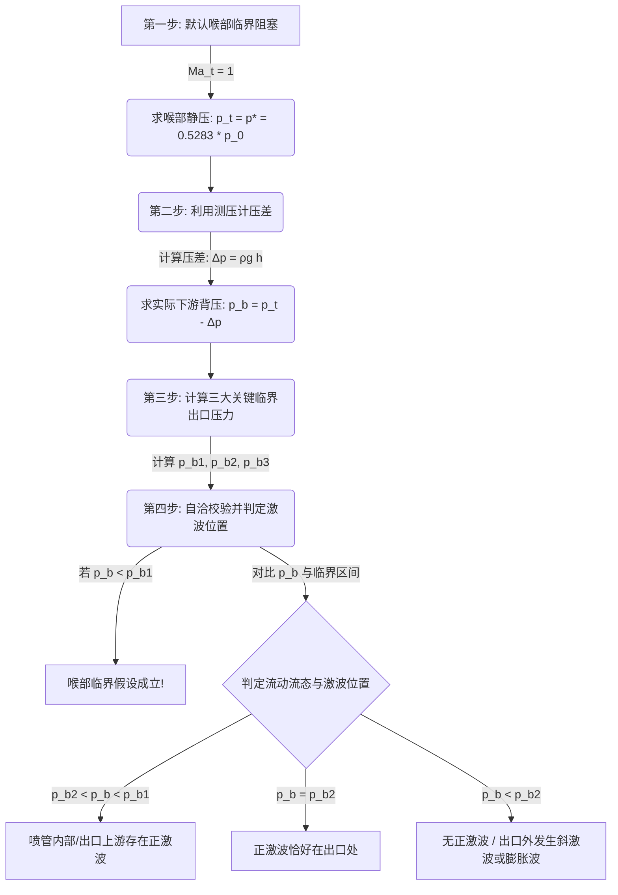

# 🚀 流体力学专题：Laval 喷管与正激波判定深度解析

本指南针对**Laval喷管流动、水银测压计耦合及正激波判定**的考试大题进行深度拆解，包含物理概念澄清、通用解题思路流程图、真题详尽解答步骤及考场避坑指南。

---

## 💡 一、 核心物理概念澄清（考前必知）

在做这类题目之前，必须先理清以下五个极易混淆的物理概念：

### 1. “连接两大气源”的断句与含义
* **断句**：应该是 **“两个（两）” + “大型（大）” + “气源（气罐，Reservoirs）”**。
* **物理含义**：喷管的左端 and 右端分别连接着两个独立的、体积巨大的封闭压力容器。
  * **左侧（上游）气源**：提供恒定的滞止状态（滞止压力 $p_0 = 300\text{ kPa}$，滞止温度 $T_0 = 100^\circ\text{C}$）。
  * **右侧（下游）气源**：维持一定的背压 $p_b$，这个压力是**未知的、可调的**，绝对不能直接当成标准大气压 $100\text{ kPa}$。

### 2. 喉部马赫数 $Ma_t$ 的上限为 $1$
* **物理规律**：在一维稳态管流中，气体只能在**渐缩段**加速，且在**喉部（截面积最小处）**最多只能加速到声速（即 $Ma_t = 1$）。
* **物理禁区**：除非在非稳态或存在极其特殊的边界条件下，稳态喷管的喉部**绝对不可能出现超音速（$Ma_t > 1$）**。

### 3. 激波后的非等熵性（阻碍直接套公式）
* **物理规律**：气流一旦穿过**正激波**，由于剧烈的间断摩擦，过程是**非等熵**的。
* **总压损失**：穿过激波后，气流的滞止压力（总压）会突降（$p_{0,\text{after}} < p_{0,\text{before}}$）。
* **计算禁区**：在激波后（如出口截面），**绝对不能**再用上游的总压 $p_0 = 300\text{ kPa}$ 直接套用等熵公式计算马赫数。

### 4. 符号辨析：下标 $t$（真实喉部）与右上角星号 $*$（虚构临界）
* **下标 $t$ (Throat)**：代表的是**真实喷管几何截面积最小的那个物理截面（喉部）**。例如，喉部实际面积 $A_t$，喉部的实际压力 $p_t$。
* **右上角星号 $*$ (Critical)**：代表的是**当流动马赫数刚好等于 1（临界）时的状态参数**。例如，临界截面面积 $A^*$，临界静压 $p^*$。
* **核心关系与等价条件**：
  * **当且仅当喉部达到临界阻塞（$Ma_t = 1$）时**，真实的喉部参数才和临界状态参数完全相等，即：
    $$A_t = A^*$$
    $$p_t = p^*$$
    $$T_t = T^*$$
  * **如果喉部未达到阻塞（即 $Ma_t < 1$）**，则它们绝不相等！此时真实的喉部面积 $A_t > A^*$，因为 $A^*$ 变成了一个“需要将通道继续收缩到多少才能使 $Ma=1$”的**虚拟参考面积**。
  * **解题应用**：本题中因为我们第一步判定（或假定）了喷管喉部阻塞，所以才能直接令 $p_t = p^*$（即 $p_t = 0.5283 p_0$）进行计算。

### 5. 为什么面积比公式 $\frac{A_e}{A_t}$ 会有两个解？
* **数学原因**：在喉部阻塞临界状态下（$A^* = A_t$），出口面积比就是几何面积比 $\frac{A_e}{A_t} = 3.0$。代入面积-马赫数关系方程：
  $$
  \frac{A_e}{A_t} = \frac{1}{Ma_e}\left( \frac{5 + Ma_e^2}{6} \right)^3 = 3.0
  $$
  这是一个关于出口马赫数 $Ma_e$ 的非线性方程。在数学上，对于任意大于 1 的面积比，都**有且仅有两个实数解**：一个解小于 1（亚声速解），一个解大于 1（超声速解）。
* **物理原因**：因为气流在通过喉部（$Ma_t = 1$）后进入扩张段，根据不同的出口压力，它有两条流动的支路：
  1. **亚声速支路**：气体在扩张段内流速降低，在出口 $A_e$ 处为亚声速，对应马赫数 $Ma_{e1} \approx 0.1974$。
  2. **超声速支路**：气体在扩张段内继续加速，在出口 $A_e$ 处达到超声速，对应马赫数 $Ma_{e2} \approx 2.6374$。
* **解题应用**：
  * 我们计算出这两个解，是为了分别求出**两条流态支路在等熵状态下的出口静压**（即极限压力）。
  * 亚声速解 $Ma_{e1}$ 算出来的是**第一临界背压 $p_{b1}$**；
  * 超声速解 $Ma_{e2}$ 算出来的是**第三临界背压 $p_{b3}$**（即设计超声速出口压力）。
  * 只有计算出这两个等熵解，我们才能划分出压力区间，进而判定背压 $p_b = 138.47\text{ kPa}$ 属于哪种流态。

---

## 🗺️ 二、 万能解题思路与判定流程图

对于任何“Laval喷管 + 测压计”的计算题，都可以套用以下四步法：

### 1. 通用解题四步法说明：
1. **第一步（求喉部静压 $p_t$）**：直接假定喉部阻塞，得到 $p_t = p^* = 0.5283 \times p_0$。
2. **第二步（求实际背压 $p_b$）**：计算测压管压差 $\Delta p = \rho_{\text{Hg}} g h$，结合水银面高低关系反推出下游气源压力 $p_b$。
3. **第三步（求临界常数）**：利用出口面积比 $\frac{A_e}{A_t}$ 解出三个等熵或含激波的特征压力极限值 $p_{b1}$、出口发生正激波时的 $p_{b2}$ 和全超声速等熵设计压力 $p_{b3}$。
4. **第四步（自洽校验与激波判定）**：
   * 检查 $p_b < p_{b1}$ 是否成立（如果成立，说明压差够大，第一步的喉部阻塞假定完全正确）。
   * 将 $p_b$ 放入区间对比，锁定激波是否存在以及具体位置。

---

## 📝 三、 真题详尽解答步骤

### 题目条件整理
* **工作介质**：空气（比热比 $\gamma = 1.4$，气体常数 $R = 287\text{ J/(kg}\cdot\text{K)}$）
* **上游滞止参数**：$p_0 = 300\text{ kPa} = 3 \times 10^5\text{ Pa}$，$T_0 = 100^\circ\text{C} = 373.15\text{ K}$
* **几何尺寸**：喉部面积 $A_t = 10\text{ cm}^2$，出口面积 $A_e = 30\text{ cm}^2$
* **测压计数据**：汞柱差 $h = 15\text{ cm} = 0.15\text{ m}$，水银密度 $\rho_{\text{Hg}} = 13600\text{ kg/m}^3$，左侧（喉部端）水银面较低。

---

### 第一问：估算下游气源压力 $p_b$

1. **计算喉部临界压力（假设喉部阻塞 $Ma_t=1$）**：
   $$
   p_t = p^* = p_0 \left(\frac{2}{\gamma+1}\right)^{\frac{\gamma}{\gamma-1}} = 300\text{ kPa} \times 0.5283 = \mathbf{158.48\text{ kPa}}
   $$

2. **计算水银柱产生的静压差 $\Delta p$**：
   $$
   \Delta p = \rho_{\text{Hg}} g h = 13600\text{ kg/m}^3 \times 9.81\text{ m/s}^2 \times 0.15\text{ m} = 20012.4\text{ Pa} \approx \mathbf{20.01\text{ kPa}}
   $$

3. **反推下游气源压力 $p_b$**：
   因测压计左侧水银面较低，表示喉部静压大于下游气源压力（$p_t > p_b$）：
   $$
   p_b = p_t - \Delta p = 158.48\text{ kPa} - 20.01\text{ kPa} = \mathbf{138.47\text{ kPa}}
   $$

---

### 第二问：判定喷管中是否有正激波及其位置

要确定流动状态，首先计算出口处的几何面积比：
$$
\frac{A_e}{A_t} = \frac{30\text{ cm}^2}{10\text{ cm}^2} = 3.0
$$

根据面积-马赫数关系，当喉部处于阻塞临界状态（$Ma_t = 1$）时，临界面积 $A^*$ 刚好等于实际喉部面积 $A_t$（即 $A^* = A_t$）。因此，我们可以直接使用题目给出的几何符号 $\frac{A_e}{A_t}$ 代入公式：
$$
\frac{A_e}{A_t} = \frac{1}{Ma_e}\left( \frac{5 + Ma_e^2}{6} \right)^3 = 3.0
$$

解得两个可能的出口马赫数 $Ma_e$：
* **亚声速解 $Ma_{e1}$**：$Ma_{e1} \approx 0.1974$
* **超声速解 $Ma_{e2}$**：$Ma_{e2} \approx 2.6374$

#### 1. 计算三个关键临界背压：
* **第一临界背压 $p_{b1}$**（对应等熵亚声速出口压力，由 $Ma_{e1}$ 计算）：
  $$
  p_{b1} = p_0 \left(1 + 0.2 \times Ma_{e1}^2\right)^{-3.5} = 300\text{ kPa} \times (1 + 0.2 \times 0.1974^2)^{-3.5} \approx \mathbf{291.95\text{ kPa}}
  $$
  *(自洽性校验：因为算得的实际下游压力 $p_b = 138.47\text{ kPa} < p_{b1} = 291.95\text{ kPa}$，说明上下游压差足够拉动流速，喉部确实处于阻塞状态，第一问假定的 $p_t = p^*$ 逻辑自洽且完全正确。)*

* **第三临界背压 $p_{b3}$**（对应等熵超声速出口设计压力，由 $Ma_{e2}$ 计算）：
  $$
  p_{b3} = p_0 \left(1 + 0.2 \times Ma_{e2}^2\right)^{-3.5} = 300\text{ kPa} \times (1 + 0.2 \times 2.6374^2)^{-3.5} \approx \mathbf{14.19\text{ kPa}}
  $$

* **第二临界背压 $p_{b2}$**（出口发生正激波时的背压，在设计超声速流 $Ma_{e2}$ 后突跃）：
  在出口前流速为设计超声速流速 $Ma_{e2} = 2.6374$，经过出口面上的正激波后升压：
  $$
  p_{b2} = p_{b3} \left[ 1 + \frac{2\gamma}{\gamma+1}(Ma_{e2}^2 - 1) \right] = 14.19\text{ kPa} \times \left[ 1 + 1.1667 \times (2.6374^2 - 1) \right] \approx \mathbf{112.79\text{ kPa}}
  $$

#### 2. 对比判定：
* 因为算出的实际下游背压 $p_b = 138.47\text{ kPa}$ 满足：
  $$
  112.79\text{ kPa} < 138.47\text{ kPa} < 291.95\text{ kPa} \quad (\text{即 } p_{b2} < p_b < p_{b1})
  $$
* **结论**：**喷管内部存在正激波**。
* **位置判定**：因为 $p_b = 138.47\text{ kPa} > p_{b2} = 112.79\text{ kPa}$，背压高于出口激波压力，这股高压会将激波向内推，因此正激波位于**喷管出口的上游一些**（即喉部与出口截面之间的渐扩段内）。

---

### 第三问：精确超音速设计工况下的水银柱高度

1. **明确设计工况的出口压力**：
   在精确的超音速设计工况下，喷管完全膨胀，出口压力刚好匹配背压：
   $$
   p_b = p_{b3} \approx \mathbf{14.19\text{ kPa}}
   $$

2. **获取喉部静压**：
   喉部仍处于临界状态，静压保持不变：
   $$
   p_t = p^* = \mathbf{158.48\text{ kPa}}
   $$

3. **求测压计压力差**：
   $$
   \Delta p' = p_t - p_b = 158.48\text{ kPa} - 14.19\text{ kPa} = 144.29\text{ kPa} = 144290\text{ Pa}
   $$

4. **计算汞柱高度 $h'$**：
   $$
   h' = \frac{\Delta p'}{\rho_{\text{Hg}} g} = \frac{144290\text{ Pa}}{13600\text{ kg/m}^3 \times 9.81\text{ m/s}^2} \approx \mathbf{1.081\text{ m}} = \mathbf{108.1\text{ cm}}
   $$

---

## 🧠 四、 核心思维纠偏与误区解析（复习与提问重点）

在做这道题以及利用 AI 辅助复习时，以下几个**思维转变和概念厘清**是最具含金量的考点：

### 1. 汉字断句误区：“两大气源”不等于“标准大气压”
* **错误直觉**：把“连接两大气源”误读为“连接大气”，从而想当然地认为下游背压 $p_b = 100\text{ kPa}$。
* **正确认知**：中文断句为 **“两个 / 大型 / 气源”**。上游气源是高压罐（$300\text{ kPa}$），下游气源也是一个封闭气罐，其背压 $p_b$ 是未知且可调的，必须通过喉部阻塞压力与水银差反推得到。

### 2. 喉部马赫数的物理极限：$Ma_t \le 1.0$
* **错误直觉**：曾想利用 $p_b = 100\text{ kPa}$ 加水银压差反推喉部压力 $p_t = 120\text{ kPa}$，套用公式算出了喉部马赫数 $Ma_t \approx 1.25$。
* **正确认知**：在稳态一维流中，渐缩段只能将气流加速到声速。**喉部的马赫数上限就是 1.0，绝对不可能在喉部出现超音速。** 因此反推必须从“假设喉部达到阻塞极限（$Ma_t = 1$）”作为起点。

### 3. 符号混淆：实际位置下标 $t$ 与临界状态星号 $*$ 的物理界限
* **符号定义**：
  * 下标 $t$ (Throat) 指的是**物理位置**，即喷管几何截面最小的那个截面。
  * 星号 $*$ (Critical) 指的是**物理状态**，即马赫数 $Ma=1$ 时的状态。
* **二者关系**：
  * **仅在喉部达到临界阻塞（$Ma_t = 1$）时，实际喉部参数才等于临界参数**（$A_t = A^*$，$p_t = p^*$）。
  * 若喉部没有阻塞（如压差太小，气流速度很慢，$Ma_t < 1$），则 $A_t > A^*$，此时 $A^*$ 是一个虚拟的、需要将管子再收缩多少才能达到声速的参考值。

### 4. 面积比公式 $\frac{A_e}{A_t}$ 为什么有两个解？
* **物理图景**：因为气流通过喉部（$Ma_t = 1$）之后进入扩张段，有两种可能的流动演变路向：
  1. **等熵亚声速路向（第一种情况）**：气体在扩张段减速，出口处为亚声速，解得较小的马赫数 $Ma_{e1} \approx 0.1974$。
  2. **等熵超声速路向（第二种情况）**：气体在扩张段继续加速，出口处达到超声速，解得较大的马赫数 $Ma_{e2} \approx 2.6374$。
* **解题意义**：这两个解分别用来算两个等熵流动的出口静压极限（$p_{b1}$ 和 $p_{b3}$），为我们判定实际背压所属的流态提供区间边界。

### 5. 激波后的总压损失
* **正确认知**：气流穿过激波是一个**强非等熵过程**。激波后气流的总压（滞止压力）会发生突降（$p_{0,\text{after}} < p_{0,\text{before}}$）。
* **计算禁区**：一旦管内有激波，在激波后面的区域（如出口面）**绝对不能直接使用上游总压 $p_0 = 300\text{ kPa}$ 直接套用等熵公式**，必须用激波前后的突跃关系计算。

### 6. 三种典型流态下，气体从“喉部 $\to$ 出口”的压力变化轨迹
* **流态 1（全等熵亚声速膨胀，对应上限 $p_{b1}$）**：
  压力从喉部的 **$158.48\text{ kPa}$ 升压到出口的 $291.95\text{ kPa}$**（流动减速）。
* **流态 2（全等熵超声速设计膨胀，对应下限 $p_{b3}$）**：
  压力从喉部的 **$158.48\text{ kPa}$ 降压到出口的 $14.19\text{ kPa}$**（流动加速）。
* **流态 3（管内/出口有正激波，对应本题实际状态及临界 $p_{b2}$）**：
  气体在喷管内先顺畅加速，压力**从喉部的 $158.48\text{ kPa}$ 降到出口前的 $14.19\text{ kPa}$**，接着在出口面遭遇正激波，压力**从 $14.19\text{ kPa}$ 瞬间骤增到 $112.79\text{ kPa}$**。

---

## ⚠️ 五、 考场避坑指南（复习必读）

| 序号 | 常见易错点 | 正确认知与应对策略 |
| :--- | :--- | :--- |
| **1** | 误把“气源”当成“标准大气压” | 记住“气源”是封闭罐子，背压 $p_b$ 是需要求解的未知数。 |
| **2** | 盲目在激波后套用 $p_0$ 公式 | 激波后有**总压损失**，旧的滞止压力 $p_0$ 失效。千万不要用 $p_0 / p_b$ 去求实际出口马赫数。 |
| **3** | 水银测压管的高低方向看错 | 压力高的一侧会把水银面**压低**。本题中左侧低，所以 $p_t > p_b$，所以 $p_b = p_t - \Delta p$。 |
| **4** | 单位换算马虎导致数量级错误 | 水银密度用 $\text{kg/m}^3$，高度 $h$ 必须换算成米（$\text{m}$），算出来的压强单位是帕（$\text{Pa}$），必须除以 1000 才能和 $\text{kPa}$ 对齐。 |

