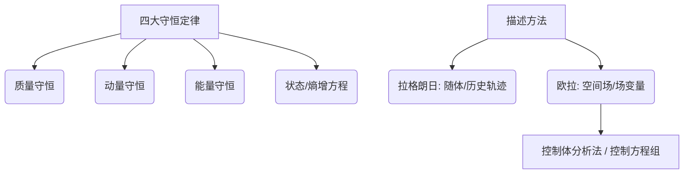

# 流体力学期末复习要点与考试指南

---

## 💡 考前必看：管道流动与能量损失套路（PVZ 记忆法）

### 1. 核心方程（左边 PVZ = 右边 PVZ + 损失之和）
* **P 项（压力）**：
  $$
  \frac{p}{\rho g}
  $$
* **V 项（速度）**：
  $$
  \alpha \frac{V^2}{2g}
  $$
  （未说明时动能修正系数 $\alpha$ 默认取 $1.0$）
* **Z 项（高度）**：
  $$
  z
  $$
  （**基准面选水平管轴线，则管轴线上各点 $z = 0$**）

### 2. 大容器液面简化技巧
* 大容器（油箱/水池）的自由液面：**压力 $p = 0$（表压），流速 $V = 0$**。

### 3. 损失项（Losses）分类汇总
* **沿程摩擦损失**：
  $$
  h_f = f \frac{L}{d} \frac{V^2}{2g}
  $$
  * 先算雷诺数：
    $$
    Re = \frac{\rho V d}{\mu} = \frac{V d}{\nu}
    $$
  * 若 $Re < 2000$（层流）：
    $$
    f = \frac{64}{Re}
    $$
  * 若 $Re > 2000$（紊流）：使用题目给出的对数等经验公式。
* **局部损失**：
  $$
  h_{\zeta} = K \frac{V^2}{2g}
  $$
  （**注意：流速 $V$ 必须用该损失所在管段的流速！**）
  * 入口：$k_e = 0.5$
  * 出口：$k_d = 1.0$
  * 突扩：
    $$
    h_x' = \frac{(V_{in} - V_{out})^2}{2g}
    $$

### 4. 两步秒杀套路
* **第一步：求流量/总水头差**
  * 在最左液面 $C$ 和最右液面 $D$ 之间列 PVZ 方程。
  * 方程直接简化为：
    $$
    \text{高度差 } h = \sum h_{\text{loss}}
    $$
* **第二步：求管内某点压力（如 A、B 点）**
  * **求 A（细管内）**：在左液面 $C$ 和 A 点之间列 PVZ 方程。
    $$
    H = \frac{p_A}{\rho g} + 1.5 \frac{V_1^2}{2g}
    $$
  * **求 B（粗管内）**：在 B 点和右液面 $D$ 之间列 PVZ 方程。
    $$
    \frac{p_B}{\rho g} = H - h
    $$

### 5. 15分真题实战模版（层流与摩擦综合题）

#### 题目条件：
* 比重 $s = 0.9 \implies \rho = 900 \text{ kg/m}^3$
* 粘度 $\mu = 0.04 \text{ Pa}\cdot\text{s}$
* 细管：直径 $D_1 = 0.1 \text{ m}$，长度 $L_1 = 50 \text{ m}$，入口系数 $k_e = 0.5$
* 粗管：直径 $D_2 = 0.4 \text{ m}$，长度 $L_2 = 100 \text{ m}$，出口系数 $k_d = 1.0$
* 突扩损失：
  $$
  h_x' = \frac{(V_1 - V_2)^2}{2g}
  $$
* 流量限制为：$Q = 0.006 \text{ m}^3\text{/s}$

#### 求解步骤：

**第①步：求各段流速**
* 细管截面积：
  $$
  A_1 = \frac{\pi}{4} \times 0.1^2 \approx 0.007854 \text{ m}^2
  $$
* 细管流速：
  $$
  V_1 = \frac{Q}{A_1} = \frac{0.006}{0.007854} \approx 0.764 \text{ m/s}
  $$
* 粗管流速（根据 $V_2 = V_1 / 16$）：
  $$
  V_2 = \frac{0.764}{16} \approx 0.0478 \text{ m/s}
  $$

**第②步：算雷诺数，判流态**
* 细管雷诺数：
  $$
  Re_1 = \frac{\rho V_1 D_1}{\mu} = \frac{900 \times 0.764 \times 0.1}{0.04} = 1719 < 2000 \quad (\text{层流})
  $$
* 粗管雷诺数：
  $$
  Re_2 = \frac{\rho V_2 D_2}{\mu} = \frac{900 \times 0.0478 \times 0.4}{0.04} \approx 430 < 2000 \quad (\text{层流})
  $$
* 两管摩擦系数：
  $$
  f_1 = \frac{64}{Re_1} = \frac{64}{1719} \approx 0.0372
  $$
  $$
  f_2 = \frac{64}{Re_2} = \frac{64}{430} \approx 0.149
  $$

**第③步：计算各项损失（PVZ右侧项，取 $g = 9.81\text{ m/s}^2$）**
* **入口局部损失**：
  $$
  h_e = 0.5 \times \frac{0.764^2}{2 \times 9.81} = 0.0149 \text{ m}
  $$
* **出口局部损失**：
  $$
  h_d = 1.0 \times \frac{0.0478^2}{2 \times 9.81} \approx 0.0001 \text{ m}
  $$
* **突扩局部损失**：
  $$
  h_x' = \frac{(0.764 - 0.0478)^2}{2 \times 9.81} = 0.0261 \text{ m}
  $$
* **细管沿程阻力损失**：
  $$
  h_{f1} = f_1 \frac{L_1}{D_1} \frac{V_1^2}{2g} = 0.0372 \times \frac{50}{0.1} \times \frac{0.764^2}{2 \times 9.81} \approx 0.5534 \text{ m}
  $$
* **粗管沿程阻力损失**：
  $$
  h_{f2} = f_2 \frac{L_2}{D_2} \frac{V_2^2}{2g} = 0.149 \times \frac{100}{0.4} \times \frac{0.0478^2}{2 \times 9.81} \approx 0.0043 \text{ m}
  $$

**第④步：求总高度差**
* 根据两液面 PVZ 方程简化结果：
  $$
  h = h_e + h_d + h_x' + h_{f1} + h_{f2}
  $$
  $$
  h = 0.0149 + 0.0001 + 0.0261 + 0.5534 + 0.0043 \approx 0.60 \text{ m}
  $$

---

## 📌 考试基本信息与评定标准

### 1. 考试规则与携带物品
* **计算器**：**必须携带计算器**（涉及大量气动函数、激波参数计算）。
* **携带资料（Cheat Sheet）**：允许携带 **3 页 A4 双面笔记**（可打印或手写，用于梳理公式、查表、总结薄弱环节）。
* **斜激波表**：老师会上传一份制作精细的**斜激波表**（书上的图表较粗糙），建议打印并作为 3 页 A4 笔记的一部分带入考场。
* **电子设备**：严禁携带/使用手机及其他智能设备。

### 2. 成绩评定与总评算法
* **常规比例**：作业 $20\%$ + 期中考试 $30\%$ + 期末考试 $50\%$。
  * *作业福利*：只要按时提交且超期未超过两周，作业分的 $20\%$ 基本能拿满。
* **期中/期末调档规则（对学生有利）**：
  * 如果 **期末考试成绩 > 期中考试成绩**，期中占比会相应下降，期末占比上升。
  * **极限提升案例**：若期中仅考了 $30 \sim 60$ 分，但期末考到了 $90$ 分，总评可以直接以 $90$ 分左右来计（按比例大幅上调，期中低分影响可忽略）。
  * 如果 **期末考试成绩 < 期中考试成绩**，则严格按照正常的 $20\% : 30\% : 50\%$ 比例计算。

---

## 🗺️ 核心知识体系架构

流体力学的底层逻辑是**四大物理守恒定律**（质量、动量、能量守恒及状态方程/熵增关系），并经历了从**随体描述（拉格朗日）**到**空间场描述（欧拉）**的转换。

---

## 📝 重点章节复习要点

### 一、 理想流体无动量损失绕流（第六章）
* **控制方程**：非线性流体方程简化为线性化的拉普拉斯方程（无粘、无旋假设）。
* **解析求解方法——叠加法**：
  * 基础解析解：**均匀流、源/汇（Source/Sink）、偶极子（Doublet）、涡流（Vortex）**。
  * 通过边界条件列出方程，利用基础解的线性叠加构造复杂绕流（如圆柱绕流）。
  * *技巧提示*：虽然不一定能求出所有复杂边界的解析解，但叠加法是势流理论的核心工具。
* **速度场与压力场**：由于流动无旋，通常先求速度势/流函数得到速度场，再利用 **伯努利方程** 求解压力场。

---

### 二、 气体动力学基础 / 可压缩流动（第七章）
* **核心参数**：马赫数 ($Ma = \frac{v}{a}$)。

#### 1. 亚声速 vs. 超声速的数学物理特性
* **亚声速 ($Ma < 1$)**：
  * 对应数学方程为**椭圆型**。
  * 扰动传播是全局的，具有全局依赖域和影响域。**必须给出全局所有的边界条件**，任何一处边界条件错误都会影响到全局流场。
* **超声速 ($Ma > 1$)**：
  * 对应数学方程为**双曲型**。
  * 扰动仅在马赫锥（影响锥）内传播，边界条件的影响具有局限性，扰动不会逆流向上传播。

#### 2. 绝热与等熵性质
* **参考状态**：**滞止状态（Stagnation State，如大容器/大罐子里的状态 $p_0, T_0$）**、**临界状态（Critical State）**。
* **能量方程**：利用一维能量方程、马赫数定义及声速公式确定各状态间的换算关系。
* 在无激波的连续流动中，滞止压力 $p_0$ 和滞止温度 $T_0$ 保持守恒。

#### 3. 激波与膨胀波理论
* **驻激波理论**：
  * **正激波（Normal Shock）**与**斜激波（Oblique Shock）**：流体经过激波后压力、温度、密度突跃升高，速度下降。
  * **非等熵过程**：激波是强烈的间断，具有熵增（非等熵，滞止压力 $p_0$ 下降），但过程是绝热的（滞止温度 $T_0$ 不变）。
  * 多重激波系统并非等强度，计算时需要逐级分析。
  * **应用判定**：根据绕流物体的几何边界判定激波发生的位置及强度，建立驻激波数学模型。
* **膨胀波（Prandtl-Meyer Expansion Waves）**：
  * 发生在气流扩张区域（如凸角绕流）。
  * 小扰动下的膨胀波是**连续且等熵**的（小熵增，可近似为等熵过程）。
* **阻挡判定**：若超声速气流迎着物体（被压缩），则会产生激波；若气流顺着物体扩张，则产生膨胀波；若物体与来流平行且无粘，则什么也不会发生。

#### 4. Laval 喷管计算与正激波判定模板（附真题解析）

##### (1) 物理规律与基本公式
* **喉部临界压力（Choking Pressure at Throat）**:
  $$
  p^* = p_0 \left(\frac{2}{\gamma+1}\right)^{\frac{\gamma}{\gamma-1}}
  $$
  对于空气（$\gamma=1.4$），$p^* \approx 0.5283 p_0$。只要下游背压 $p_b$ 低于第一临界背压 $p_{b1}$，喉部即达到声速（$Ma_t=1$），喉部压力保持为 $p^*$。
* **面积比与马赫数关系（Area-Mach Relation）**:
  $$
  \frac{A}{A^*} = \frac{1}{Ma}\left[\frac{2}{\gamma+1}\left(1+\frac{\gamma-1}{2}Ma^2\right)\right]^{\frac{\gamma+1}{2(\gamma-1)}}
  $$
  对于空气（$\gamma=1.4$），公式简化为：
  $$
  \frac{A}{A^*} = \frac{1}{Ma}\left( \frac{5 + Ma^2}{6} \right)^3
  $$
  由出口面积比 $A_e/A_t$ 可解出两个马赫数：
  * **亚声速解**：$Ma_{e,\text{sub}}$
  * **超声速解**：$Ma_{e,\text{sup}}$
* **关键背压临界点**:
  * **第一临界背压 $p_{b1}$**（等熵亚声速出口压力）：
    $$
    p_{b1} = p_0 \left(1 + \frac{\gamma-1}{2}Ma_{e,\text{sub}}^2\right)^{-\frac{\gamma}{\gamma-1}}
    $$
  * **等熵超声速设计出口压力 $p_{e,\text{sup}}$**：
    $$
    p_{e,\text{sup}} = p_0 \left(1 + \frac{\gamma-1}{2}Ma_{e,\text{sup}}^2\right)^{-\frac{\gamma}{\gamma-1}}
    $$
  * **第二临界背压 $p_{b2}$**（正激波恰好在出口处）：
    $$
    p_{b2} = p_{e,\text{sup}} \left[1 + \frac{2\gamma}{\gamma+1}(Ma_{e,\text{sup}}^2 - 1)\right]
    $$

##### (2) 流态与激波位置判定准则
| 背压范围 | 喉部状态 | 喷管内部流动状态 | 激波/膨胀波位置 |
| :--- | :--- | :--- | :--- |
| $p_b > p_{b1}$ | 未临界 ($Ma_t < 1$) | 全管亚声速流动 | 无激波 |
| $p_b = p_{b1}$ | 临界 ($Ma_t = 1$) | 全管亚声速流动 | 无激波（第一临界点） |
| $p_{b2} < p_b < p_{b1}$ | 临界 ($Ma_t = 1$) | 先超声速后亚声速 | **喷管内部（出口上游）存在正激波** |
| $p_b = p_{b2}$ | 临界 ($Ma_t = 1$) | 全管超声速 | **正激波恰好位于喷管出口截面** |
| $p_{e,\text{sup}} < p_b < p_{b2}$ | 临界 ($Ma_t = 1$) | 全管超声速 | 出口外发生过膨胀（产生**斜激波**） |
| $p_b = p_{e,\text{sup}}$ | 临界 ($Ma_t = 1$) | 全管超声速 | 无激波（等熵超声速设计工况） |
| $p_b < p_{e,\text{sup}}$ | 临界 ($Ma_t = 1$) | 全管超声速 | 出口外发生欠膨胀（产生**膨胀波**） |

##### (3) 核心真题实战：U型管测压与激波位置分析
> **真题回顾**：
> 空气流过一连接两大气源的 Laval 喷管，连接喉部 and 下游气源的水银柱高为 $h = 15\text{ cm}$，左侧（喉部端）水银面较低。滞止参数为 $T_0 = 100^\circ\text{C}$，$p_0 = 300\text{ kPa}$。喉部面积 $A_t = 10\text{ cm}^2$，出口面积 $A_e = 30\text{ cm}^2$。
> 1. 估算下游气源压力 $p_b$。
> 2. 喷管中有正激波吗？如果有，它是在喷管出口还是上游一些？
> 3. 如果该喷管精确地运行于超音速的设计条件，水银柱高应为多少？

**💡 详细求解步骤**：

**第①步：求喉部压力 $p_t$ 与测压差 $\Delta p$**
* 假定喉部达到临界条件（后面会通过算得的 $p_b$ 进行自洽性校验）：
  $$
  p_t = p^* = 0.5283 \times p_0 = 0.5283 \times 300\text{ kPa} = 158.48\text{ kPa}
  $$
* U形管读数 $h = 15\text{ cm} = 0.15\text{ m}$，水银密度 $\rho_{\text{Hg}} = 13600\text{ kg/m}^3$。
* 左侧水银面较低，说明喉部压力大于下游气源压力（$p_t > p_b$）：
  $$
  \Delta p = p_t - p_b = \rho_{\text{Hg}} g h = 13600 \times 9.81 \times 0.15 = 20012.4\text{ Pa} \approx 20.01\text{ kPa}
  $$
* 下游气源压力（背压）：
  $$
  p_b = p_t - \Delta p = 158.48 - 20.01 = 138.47\text{ kPa}
  $$

**第②步：校验喉部临界假设并判定激波位置**
* 计算喷管出口的面积比：
  $$
  \frac{A_e}{A_t} = \frac{30}{10} = 3.0
  $$
* 根据面积-马赫数关系，解得等熵出口马赫数：
  * 亚声速解：$Ma_{e,\text{sub}} \approx 0.1974$
  * 超声速解：$Ma_{e,\text{sup}} \approx 2.637$
* 计算对应的临界背压：
  * **第一临界背压（等熵亚声速出口压力）**：
    $$
    p_{b1} = p_0 \left(1 + 0.2 \times 0.1974^2\right)^{-3.5} \approx 291.95\text{ kPa}
    $$
    *校验*：因为实际背压 $p_b = 138.47\text{ kPa} < p_{b1} = 291.95\text{ kPa}$，说明喷管喉部确实被“阻塞”并达到了临界状态，我们第一步的假设 $p_t = p^*$ 成立！
  * **等熵超声速设计出口压力**：
    $$
    p_{e,\text{sup}} = p_0 \left(1 + 0.2 \times 2.637^2\right)^{-3.5} \approx 14.19\text{ kPa}
    $$
  * **第二临界背压（出口发生正激波时的出口压力）**：
    $$
    p_{b2} = p_{e,\text{sup}} \left[1 + \frac{2.8}{2.4}(2.637^2 - 1)\right] \approx 14.19 \times 7.948 \approx 112.79\text{ kPa}
    $$
* **判定激波存在性与位置**：
  * 由于 $p_{b2} < p_b < p_{b1}$（即 $112.79\text{ kPa} < 138.47\text{ kPa} < 291.95\text{ kPa}$），**喷管内部存在正激波**。
  * 由于 $p_b = 138.47\text{ kPa} > p_{b2} = 112.79\text{ kPa}$，压力比出口处发生激波时高，说明正激波位于**喷管出口的上游一些**（即喉部到出口之间的渐扩段内）。

**第③步：求精确超音速设计工况下的水银柱高度**
* 在精确超音速设计条件下，出口流出的是完全展开的超音速流，且出口静压与背压相匹配：
  $$
  p_b = p_{e,\text{sup}} \approx 14.19\text{ kPa}
  $$
* 此时喉部仍处于临界状态：$p_t = p^* = 158.48\text{ kPa}$。
* 此时U形压力计的压力差为：
  $$
  \Delta p' = p_t - p_b = 158.48 - 14.19 = 144.29\text{ kPa} = 144290\text{ Pa}
  $$
* 对应的水银柱高度为：
  $$
  h' = \frac{\Delta p'}{\rho_{\text{Hg}} g} = \frac{144290}{13600 \times 9.81} \approx 1.081\text{ m} = 108.1\text{ cm}
  $$

---

### 三、 粘性流体动力学（第六章后半部分/第八九章）
* **控制方程**：考虑粘性项的 **Navier-Stokes (N-S) 方程组**。
* **流动状态**：由雷诺数 ($Re$) 判定**层流（Laminar）**与**湍流（Turbulent）**。

#### 1. N-S 方程的精确解析解
目前已知的精确解仅有 80 多个，重点掌握以下两种典型平行流动：
* **哈根-泊肃叶流动（Hagen-Poiseuille Flow）**：圆管内的压力驱动流动，需重点掌握**压降损失**与流量的关系。
* **库埃特流动（Couette Flow）**：剪切驱动流（平板移动）。
  * *求解技巧*：根据实际边界条件（如平板倾斜角度、是否考虑重力分量等），利用通解确定常数，求解速度分布。

#### 2. 近似求解方法
* **低雷诺数流动（蠕动流 / Stokes近似）**：惯性项远小于粘性项，直接忽略惯性项进行简化求解。
* **高雷诺数流动（边界层理论）**：
  * 粘性效应被限制在壁面附近极薄的**边界层（Boundary Layer）**内。
  * 利用数量级分析（量纲分析）简化 N-S 方程，得到边界层方程。
  * **层流边界层**：使用 **Blasius 相似性解**。
  * **湍流边界层**：采用近似求解法（如 $1/7$ 次方速度分布等经验公式）计算摩擦阻力。
  * **边界层特征厚度**：物理厚度 $\delta$、位移厚度 $\delta^*$、动量厚度 $\theta$ 的定义与计算。

#### 3. 流动分离与阻力分析
* **流动分离（Flow Separation）**：
  * 发生在**逆压梯度区**（压强升高的区域）。
  * 一旦发生流动分离，传统的边界层理论将不再适用。
* **阻力构成**：
  * **摩擦阻力（Friction Drag）**：由壁面切应力产生。
  * **压差阻力（Pressure Drag）**：由流动分离导致的壁面压力差产生。
  * 在大雷诺数绕流且发生分离时，压差阻力通常占主导地位。

---

## ✏️ 期末考试题型预测与备考建议

1. **概念题（约 30 分）**：
   * 题型：对错判断、选择题。
   * 考点：椭圆型/双曲型方程特征、激波/膨胀波的等熵性、边界层分离条件、拉格朗日与欧拉描述的区别等。
2. **计算题（约 70 分）**：
   * **控制体分析法（积分形式动量方程）**：求流体对物体的作用力（如喷管、弯管等力学计算，此部分期中考过，期末仍会结合考察）。
   * **管道粘性流动/哈根-泊肃叶流动**：结合重力、压力梯度求解速度分布及压差损失。
   * **可压缩流动与激波计算**：利用气动函数表/激波表，计算经过正/斜激波后的参数变化，或求滞止参数与静参数的换算。
3. **备考策略**：
   * 熟练掌握气动函数表的查表步骤，避免考试时因为不熟悉表格而浪费时间。
   * 精心整理 3 页 A4 纸：左边列公式（N-S方程简化、激波关系式、边界层厚度公式），右边整理典型例题与作业题步骤。
